author: Cameron Shimmin, Dureti Shemsi
id: zero-to-snowflake
categories: snowflake-site:taxonomy/solution-center/certification/quickstart, snowflake-site:taxonomy/product/platform, snowflake-site:taxonomy/snowflake-feature/ingestion, snowflake-site:taxonomy/snowflake-feature/transformation, snowflake-site:taxonomy/snowflake-feature/dynamic-tables
language: ja
summary: Zero to Snowflake 
environments: web
status: Published
feedback link: https://github.com/Snowflake-Labs/sfguides/issues

# Zero to Snowflake

## 概要


### 概要

Zero to Snowflake クイックスタートへようこそ！このガイドは、Snowflake AI Data Cloud の主要な領域を網羅した総合的なハンズオンです。仮想ウェアハウスとデータ変換の基礎から始まり、自動化されたデータパイプラインを構築します。その後、Cortex Playground を使って LLM を試し、テキスト要約のためにさまざまなモデルを比較する方法を学び、AISQL 関数を使った簡単な SQL コマンドで顧客レビューのセンチメント分析を即座に行い、Cortex Search でインテリジェントなテキスト検索を行い、Cortex Analyst による会話形式のビジネスインテリジェンスを活用する方法を学びます。最後に、強力なガバナンス制御でデータを保護し、シームレスなデータコラボレーションを通じて分析を強化する方法を学びます。

これらの概念は、架空のフードトラック企業「Tasty Bytes」のサンプルデータセットを使って適用し、データ運用の改善と効率化を図ります。このデータセットをいくつかのワークロード別シナリオで探索し、Snowflake がビジネスにもたらすメリットを実証します。

### Tasty Bytes とは？

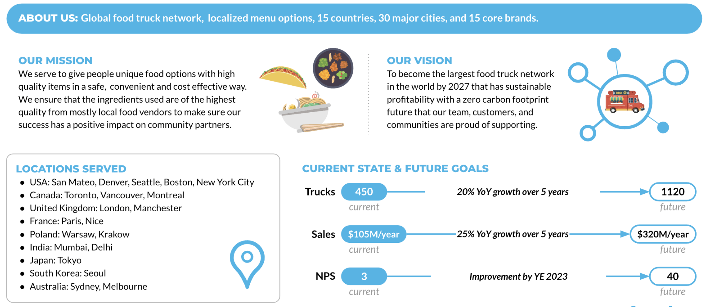

私たちのミッションは、地元ベンダーの新鮮な食材を重視しながら、便利でコスト効果の高い方法でユニークで高品質な食の選択肢を提供することです。そのビジョンは、カーボンフットプリントゼロで世界最大のフードトラックネットワークになることです。

### 前提条件

 - サポートされている Snowflake [ブラウザ](https://docs.snowflake.com/en/user-guide/setup?_fsi=6tNBra0z&_fsi=6tNBra0z#browser-requirements)
 - Enterprise または Business Critical の Snowflake アカウント
 - Snowflake アカウントをお持ちでない場合は、[30日間無料トライアルアカウントにサインアップ](https://signup.snowflake.com/?utm_source=snowflake-devrel&utm_medium=developer-guides&utm_cta=developer-guides&_fsi=6tNBra0z&_fsi=6tNBra0z)してください。サインアップ時は Enterprise エディションを選択してください。[Snowflake クラウド/リージョン](https://docs.snowflake.com/en/user-guide/intro-regions?_fsi=6tNBra0z&_fsi=6tNBra0z)はいずれでも構いません。
 - 登録後、アクティベーションリンクと Snowflake アカウント URL が記載されたメールが届きます。

### 学習内容

  - **ビネット 1: Snowflake 入門:** 仮想ウェアハウス、キャッシュ、クローニング、タイムトラベルの基礎。
  - **ビネット 2: シンプルなデータパイプライン:** ダイナミックテーブルを使った半構造化データの取り込みと変換方法。
  - **ビネット 3: Snowflake Cortex AI:** 実験、スケーラブルな分析、AI 支援開発、会話型ビジネスインテリジェンスのために Snowflake の包括的な AI 機能を活用する方法。
  - **ビネット 4: Horizon によるガバナンス:** ロール、分類、マスキング、行アクセスポリシーでデータを保護する方法。
  - **ビネット 5: アプリとコラボレーション:** Snowflake マーケットプレイスを活用して、内部データをサードパーティデータセットで強化する方法。

### 構築するもの

  - Snowflake コアプラットフォームの包括的な理解。
  - 設定済みの仮想ウェアハウス。
  - ダイナミックテーブルを使った自動化 ELT パイプライン。
  - Snowflake AI を活用した完全なインテリジェント顧客分析プラットフォーム。
  - ロールとポリシーを使った堅牢なデータガバナンスフレームワーク。
  - ファーストパーティとサードパーティのデータを組み合わせた強化された分析ビュー。

## セットアップ

### **概要**

このガイドでは、<a href="https://app.snowflake.com/_deeplink/#/workspaces?utm_source=snowflake-devrel&utm_medium=developer-guides&utm_content=zero-to-snowflake&utm_cta=developer-guides-deeplink" class="_deeplink">Snowflake Workspaces</a> を使用して、このコースに必要なすべての SQL スクリプトを整理・編集・実行します。セットアップ用と各ビネット用に専用の SQL ファイルを作成します。これによりコードが整理され、管理が容易になります。

最初の SQL ファイルの作成方法、必要なセットアップコードの追加方法、および実行方法を説明します。

### **ステップ 1 - セットアップ SQL ファイルの作成**

まず、セットアップスクリプトを置く場所が必要です。

1. **<a href="https://app.snowflake.com/_deeplink/#/workspaces?utm_source=snowflake-devrel&utm_medium=developer-guides&utm_content=zero-to-snowflake&utm_cta=developer-guides-deeplink" class="_deeplink">Workspaces</a> に移動:** Snowflake UI の左側ナビゲーションメニューで **Projects** » **<a href="https://app.snowflake.com/_deeplink/#/workspaces?utm_source=snowflake-devrel&utm_medium=developer-guides&utm_content=zero-to-snowflake-deeplink" class="_deeplink">Workspaces</a>** をクリックします。これがすべての SQL ファイルの中心的なハブです。
2. **新しい SQL ファイルの作成:** <a href="https://app.snowflake.com/_deeplink/#/workspaces?utm_source=snowflake-devrel&utm_medium=developer-guides&utm_content=zero-to-snowflake&utm_cta=developer-guides-deeplink" class="_deeplink">Workspaces</a> エリアの左上にある **+ Add New** ボタンを見つけてクリックし、**SQL File** を選択します。これにより新しい空の SQL ファイルが生成されます。
3. **SQL ファイルのリネーム:** 新しい SQL ファイルは作成されたタイムスタンプに基づく名前になっています。**Zero To Snowflake - Setup** などのわかりやすい名前を付けてください。

### **ステップ 2 - セットアップスクリプトの追加と実行**

SQL ファイルができたので、セットアップ SQL を追加して実行します。

1. **SQL コードのコピー:** **[セットアップファイル](https://github.com/Snowflake-Labs/sfguide-getting-started-from-zero-to-snowflake/blob/main/scripts/setup.sql)** のリンクをクリックし、クリップボードにコピーします。
2. **SQL ファイルへの貼り付け:** Snowflake の Zero To Snowflake Setup SQL ファイルに戻り、スクリプト全体をエディタに貼り付けます。
3. **スクリプトの実行:** SQL ファイル内のすべてのコマンドを順次実行するには、エディタ左上にある **「Run All」** ボタンをクリックします。これにより、以降のビネットに必要なロール、スキーマ、ウェアハウスの作成などのセットアップ処理がすべて実行されます。


### **今後の作業について**

新しい SQL ファイルを作成するプロセスは、このコースの以降のすべてのビネットで使用するまったく同じワークフローです。

各新しいビネットでは以下を行います：

1. **新しい** SQL ファイルを作成する。
2. わかりやすい名前を付ける（例：Vignette 1 - Getting Started with Snowflake）。
3. そのビネット用の SQL スクリプトをコピーして貼り付ける。
4. 各 SQL ファイルには、手順に沿って進めるために必要なすべての指示とコマンドが含まれています。

<!-- end list -->

## Snowflake 入門


### 概要

このビネットでは、仮想ウェアハウスの探索、クエリ結果キャッシュの活用、基本的なデータ変換の実行、タイムトラベルによるデータリカバリの活用、リソースモニターとバジェットによるアカウントの監視を通じて、Snowflake のコアコンセプトを学びます。

### 学習内容
- 仮想ウェアハウスの作成、設定、スケーリング方法。
- クエリ結果キャッシュの活用方法。
- 開発用にゼロコピークローニングを使用する方法。
- データの変換とクリーニング方法。
- UNDROP を使用してドロップされたテーブルを即座に復元する方法。
- リソースモニターの作成と適用方法。
- コストを監視するためのバジェット作成方法。
- ユニバーサルサーチを使用してオブジェクトや情報を検索する方法。

### 構築するもの
- Snowflake 仮想ウェアハウス
- ゼロコピークローンを使用したテーブルの開発コピー
- リソースモニター
- バジェット

### SQL コードを取得して SQL ファイルに貼り付けます。

**この[ファイル](https://github.com/Snowflake-Labs/sfguide-getting-started-from-zero-to-snowflake/blob/main/scripts/vignette-1.sql)の SQL コードをコピーして、Snowflake の新しい SQL ファイルに貼り付けて進めてください。SQL ファイルの最後まで到達したら、ステップ 10 - シンプルなデータパイプラインにスキップできます。**

### 仮想ウェアハウスと設定


#### 概要

仮想ウェアハウスは、Snowflake データの分析を実行できる動的でスケーラブルかつコスト効果の高いコンピューティングパワーです。その目的は、基礎となる技術的な詳細を気にすることなく、すべてのデータ処理ニーズを処理することです。

#### ステップ 1 - コンテキストの設定

まず、セッションコンテキストを設定します。クエリを実行するには、SQL ファイル上部の 3 つのクエリをハイライトして「► Run」ボタンをクリックします。

```sql
ALTER SESSION SET query_tag = '{"origin":"sf_sit-is","name":"tb_zts,"version":{"major":1, "minor":1},"attributes":{"is_quickstart":1, "source":"tastybytes", "vignette": "getting_started_with_snowflake"}}';

USE DATABASE tb_101;
USE ROLE accountadmin;
```

#### ステップ 2 - ウェアハウスの作成

最初のウェアハウスを作成しましょう！このコマンドは、最初はサスペンド状態の新しい X-Small ウェアハウスを作成します。

```sql
CREATE OR REPLACE WAREHOUSE my_wh
    COMMENT = 'My TastyBytes warehouse'
    WAREHOUSE_TYPE = 'standard'
    WAREHOUSE_SIZE = 'xsmall'
    MIN_CLUSTER_COUNT = 1
    MAX_CLUSTER_COUNT = 2
    SCALING_POLICY = 'standard'
    AUTO_SUSPEND = 60
    INITIALLY_SUSPENDED = true
    AUTO_RESUME = false;
```

> **仮想ウェアハウス**: 仮想ウェアハウス（単に「ウェアハウス」とも呼ばれます）は、Snowflake のコンピューティングリソースのクラスターです。ウェアハウスはクエリ、DML 操作、データロードに必要です。詳細については[ウェアハウスの概要](https://docs.snowflake.com/en/user-guide/warehouses-overview)を参照してください。

#### ステップ 3 - ウェアハウスの使用と再開

ウェアハウスができたので、セッションのアクティブウェアハウスとして設定する必要があります。次のステートメントを実行します。

```sql
USE WAREHOUSE my_wh;
```

以下のクエリを実行しようとすると失敗します。ウェアハウスがサスペンド状態で、`AUTO_RESUME` が有効になっていないためです。
```sql
SELECT * FROM raw_pos.truck_details;
```

ウェアハウスを再開し、今後は自動再開するように設定しましょう。
```sql
ALTER WAREHOUSE my_wh RESUME;
ALTER WAREHOUSE my_wh SET AUTO_RESUME = TRUE;
```

もう一度クエリを試してください。今度は正常に実行されるはずです。

```sql
SELECT * FROM raw_pos.truck_details;
```

#### ステップ 4 - ウェアハウスのスケーリング

Snowflake のウェアハウスは弾力性を持つよう設計されています。より集中的なワークロードに対応するために、ウェアハウスをオンザフライでスケールアップできます。ウェアハウスを X-Large にスケールアップしましょう。

```sql
ALTER WAREHOUSE my_wh SET warehouse_size = 'XLarge';
```

より大きなウェアハウスで、トラックブランドごとの総売上を計算するクエリを実行しましょう。

```sql
SELECT
    o.truck_brand_name,
    COUNT(DISTINCT o.order_id) AS order_count,
    SUM(o.price) AS total_sales
FROM analytics.orders_v o
GROUP BY o.truck_brand_name
ORDER BY total_sales DESC;
```

### クエリ結果キャッシュ


#### 概要

ここは Snowflake のもう一つの強力な機能「クエリ結果キャッシュ」を示すのに最適な場所です。「トラックごとの売上」クエリを最初に実行したとき、数秒かかったかもしれません。まったく同じクエリを再度実行すると、結果はほぼ即座に返されます。これは、クエリ結果が Snowflake のクエリ結果キャッシュにキャッシュされているためです。

#### ステップ 1 - クエリの再実行

前のステップと同じ「トラックごとの売上」クエリを実行します。クエリ詳細ペインで実行時間に注目してください。大幅に速くなっているはずです。

```sql
SELECT
    o.truck_brand_name,
    COUNT(DISTINCT o.order_id) AS order_count,
    SUM(o.price) AS total_sales
FROM analytics.orders_v o
GROUP BY o.truck_brand_name
ORDER BY total_sales DESC;
```
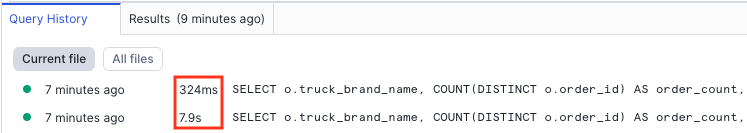

> **クエリ結果キャッシュ**: クエリの結果は 24 時間保持されます。結果キャッシュのヒットにはほとんどコンピューティングリソースが必要ないため、頻繁に実行されるレポートやダッシュボードに最適です。キャッシュはクラウドサービス層に存在し、アカウント内のすべてのユーザーとウェアハウスからグローバルにアクセス可能です。詳細については[永続化されたクエリ結果の使用に関するドキュメント](https://docs.snowflake.com/en/user-guide/querying-persisted-results)を参照してください。

#### ステップ 2 - スケールダウン

これからは小さなデータセットを扱うため、クレジットを節約するためにウェアハウスを X-Small にスケールダウンできます。

```sql
ALTER WAREHOUSE my_wh SET warehouse_size = 'XSmall';
```

### 基本的な変換テクニック


#### 概要

このセクションでは、データをクリーンにするための基本的な変換テクニックと、開発環境を作成するためのゼロコピークローニングを紹介します。フードトラックのメーカーを分析することが目標ですが、このデータは現在 `VARIANT` カラム内にネストされています。

#### ステップ 1 - ゼロコピークローンを使った開発テーブルの作成

まず `truck_build` カラムを確認しましょう。
```sql
SELECT truck_build FROM raw_pos.truck_details;
```
このテーブルには各トラックのメーカー、モデル、年式のデータが含まれていますが、VARIANT と呼ばれる特殊なデータ型にネスト（埋め込み）されています。このカラムに対して操作を実行してこれらの値を抽出できますが、まず開発用コピーを作成します。

`truck_details` テーブルの開発コピーを作成しましょう。Snowflake のゼロコピークローニングを使うと、追加ストレージを使用せずに即座にテーブルの完全な独立コピーを作成できます。

```sql
CREATE OR REPLACE TABLE raw_pos.truck_dev CLONE raw_pos.truck_details;
```

> **[ゼロコピークローニング](https://docs.snowflake.com/en/user-guide/object-clone)**: クローニングはストレージを複製せずにデータベースオブジェクトのコピーを作成します。オリジナルまたはクローンのどちらかに加えられた変更は新しいマイクロパーティションとして保存され、もう一方のオブジェクトには影響しません。

#### ステップ 2 - 新しいカラムの追加とデータの変換

安全な開発テーブルができたので、`year`、`make`、`model` のカラムを追加します。次に、`truck_build` の `VARIANT` カラムからデータを抽出して新しいカラムに入力します。

```sql
-- 新しいカラムを追加
ALTER TABLE raw_pos.truck_dev ADD COLUMN IF NOT EXISTS year NUMBER;
ALTER TABLE raw_pos.truck_dev ADD COLUMN IF NOT EXISTS make VARCHAR(255);
ALTER TABLE raw_pos.truck_dev ADD COLUMN IF NOT EXISTS model VARCHAR(255);

-- データを抽出して更新
UPDATE raw_pos.truck_dev
SET 
    year = truck_build:year::NUMBER,
    make = truck_build:make::VARCHAR,
    model = truck_build:model::VARCHAR;
```

#### ステップ 3 - データのクリーニング

トラックメーカーの分布を確認するクエリを実行しましょう。

```sql
SELECT 
    make,
    COUNT(*) AS count
FROM raw_pos.truck_dev
GROUP BY make
ORDER BY make ASC;
```

最後のクエリの結果に何か奇妙なことに気づきましたか？データ品質の問題が確認できます。「Ford」と「Ford_」が別々のメーカーとして扱われています。シンプルな `UPDATE` ステートメントでこれを簡単に修正しましょう。

```sql
UPDATE raw_pos.truck_dev
    SET make = 'Ford'
    WHERE make = 'Ford_';
```
ここでは、make の値が `Ford_` の行を `Ford` に設定することを指定しています。これにより、Ford のメーカーにアンダースコアが付かなくなり、統一されたメーカー数が得られます。

#### ステップ 4 - SWAP を使った本番環境へのプロモート

開発テーブルがクリーンになり、正しくフォーマットされました。`SWAP WITH` コマンドを使って、即座に新しい本番テーブルとしてプロモートできます。これにより 2 つのテーブルがアトミックに入れ替えられます。

```sql
ALTER TABLE raw_pos.truck_details SWAP WITH raw_pos.truck_dev;
```

#### ステップ 5 - クリーンアップ

スワップが完了したので、新しい本番テーブルから不要な `truck_build` カラムをドロップできます。また、現在 `truck_dev` という名前になっている古い本番テーブルもドロップする必要があります。ただし、次のレッスンのために、メインテーブルを「誤って」ドロップします。

```sql
ALTER TABLE raw_pos.truck_details DROP COLUMN truck_build;

-- 誤って本番テーブルをドロップ！
DROP TABLE raw_pos.truck_details;
```

#### ステップ 6 - UNDROP によるデータリカバリ

大変です！誤って本番テーブル `truck_details` をドロップしてしまいました。幸い、Snowflake のタイムトラベル機能により即座に復元できます。`UNDROP` コマンドはドロップされたオブジェクトを復元します。

#### ステップ 7 - ドロップの確認

テーブルに対して `DESCRIBE` コマンドを実行すると、存在しないというエラーが表示されます。

```sql
DESCRIBE TABLE raw_pos.truck_details;
```

#### ステップ 8 - UNDROP でテーブルを復元

`truck_details` テーブルをドロップ前の状態に復元しましょう。

```sql
UNDROP TABLE raw_pos.truck_details;
```

> **[タイムトラベルと UNDROP](https://docs.snowflake.com/en/user-guide/data-time-travel)**: Snowflake タイムトラベルは、定義された期間内の任意の時点での過去データへのアクセスを可能にします。これにより、変更または削除されたデータを復元できます。`UNDROP` はタイムトラベルの機能で、誤ってドロップした場合の復旧を簡単にします。

#### ステップ 9 - 復元の確認とクリーンアップ

テーブルが正常に復元されたことを SELECT で確認します。その後、実際の開発テーブル `truck_dev` を安全にドロップできます。

```sql
-- テーブルが復元されたことを確認
SELECT * from raw_pos.truck_details;

-- 実際の truck_dev テーブルをドロップ
DROP TABLE raw_pos.truck_dev;
```

### リソースモニター


#### 概要

コンピューティング使用量の監視は重要です。Snowflake はウェアハウスのクレジット使用量を追跡するリソースモニターを提供しています。クレジットクォータを定義し、しきい値に達したときにアクション（通知やサスペンドなど）をトリガーできます。

#### ステップ 1 - リソースモニターの作成

`my_wh` 用のリソースモニターを作成しましょう。このモニターは月間クォータ 100 クレジットで、クォータの 75% で通知を送信し、90% と 100% でウェアハウスをサスペンドします。まず、ロールが `accountadmin` であることを確認してください。

```sql
USE ROLE accountadmin;

CREATE OR REPLACE RESOURCE MONITOR my_resource_monitor
    WITH CREDIT_QUOTA = 100
    FREQUENCY = MONTHLY
    START_TIMESTAMP = IMMEDIATELY
    TRIGGERS ON 75 PERCENT DO NOTIFY
             ON 90 PERCENT DO SUSPEND
             ON 100 PERCENT DO SUSPEND_IMMEDIATE;
```

#### ステップ 2 - リソースモニターの適用

モニターが作成されたので、`my_wh` に適用します。

```sql
ALTER WAREHOUSE my_wh 
    SET RESOURCE_MONITOR = my_resource_monitor;
```

> 各設定の詳細については、[リソースモニターの操作に関するドキュメント](https://docs.snowflake.com/en/user-guide/resource-monitors)を参照してください。

### バジェットの作成


#### 概要

リソースモニターがウェアハウスの使用量を追跡する一方、バジェットはすべての Snowflake コストを管理するより柔軟なアプローチを提供します。バジェットは任意の Snowflake オブジェクトの支出を追跡し、ドル金額のしきい値に達したときにユーザーに通知できます。

#### ステップ 1 - SQL でバジェットを作成

まず、SQL でバジェットオブジェクトを作成します。

```sql
CREATE OR REPLACE SNOWFLAKE.CORE.BUDGET my_budget()
    COMMENT = 'My Tasty Bytes Budget';
```

#### ステップ 2 - Snowsight のバジェットページ
Snowsight のバジェットページを確認しましょう。

**Admin** » **Cost Management** » **Budgets** に移動します。

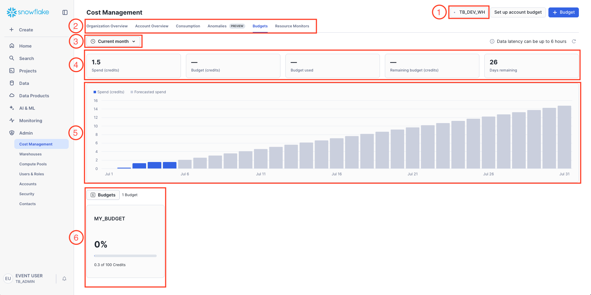

**凡例:**
1. ウェアハウスコンテキスト
2. コスト管理ナビゲーション
3. 期間フィルター
4. 主要指標サマリー
5. 支出と予測トレンドチャート
6. バジェットの詳細

#### ステップ 3 - Snowsight でのバジェット設定

バジェットの設定は Snowsight の UI から行います。

1.  アカウントロールが `ACCOUNTADMIN` に設定されていることを確認します。左下隅で変更できます。
2.  作成した **MY_BUDGET** バジェットをクリックします。
3.  **Budget Details** をクリックしてバジェット詳細パネルを開き、右側のバジェット詳細パネルで **Edit** をクリックします。
4.  **Spending Limit** を `100` に設定します。
5.  確認済みの通知メールアドレスを入力します。
6.  **+ Tags & Resources** をクリックし、監視対象として **TB_101.ANALYTICS** スキーマと **TB_DE_WH** ウェアハウスを追加します。
7.  **Save Changes** をクリックします。
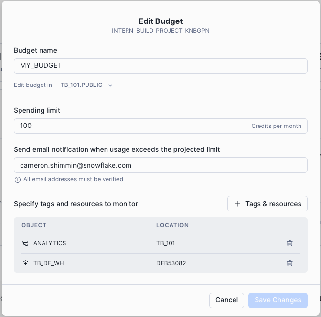

> バジェットの詳細なガイドについては、[Snowflake バジェットドキュメント](https://docs.snowflake.com/en/user-guide/budgets)を参照してください。

### ユニバーサルサーチ


#### 概要

ユニバーサルサーチを使うと、アカウント内の任意のオブジェクトを簡単に見つけ、マーケットプレイスのデータ製品、関連する Snowflake ドキュメント、コミュニティナレッジベースの記事を探索できます。

#### ステップ 1 - オブジェクトの検索

試してみましょう。

1.  左側のナビゲーションメニューで **Search** をクリックします。
2.  検索バーに `truck` と入力します。
3.  結果を確認します。テーブルやビューなどのアカウント上のオブジェクトのカテゴリと、関連するドキュメントが表示されます。

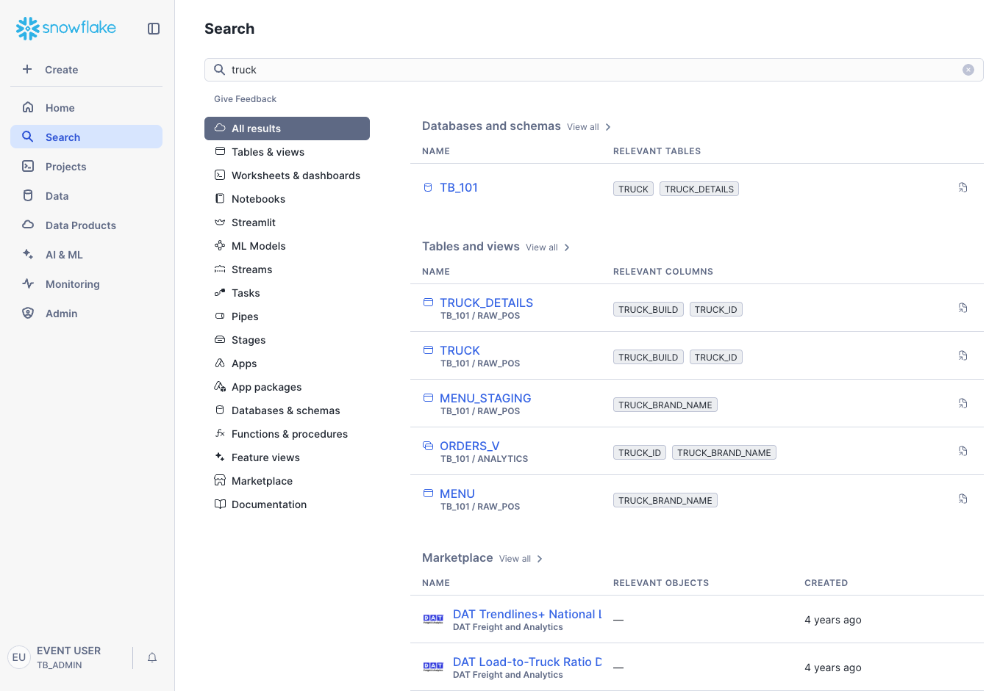

#### ステップ 2 - 自然言語検索の使用

自然言語も使用できます。例えば、`Which truck franchise has the most loyal customer base?`（どのトラックフランチャイズが最も忠実な顧客基盤を持っていますか？）を検索してみてください。
ユニバーサルサーチは、質問への回答に役立つ可能性のあるカラムをハイライトしながら関連するテーブルやビューを返し、分析の優れた出発点を提供します。

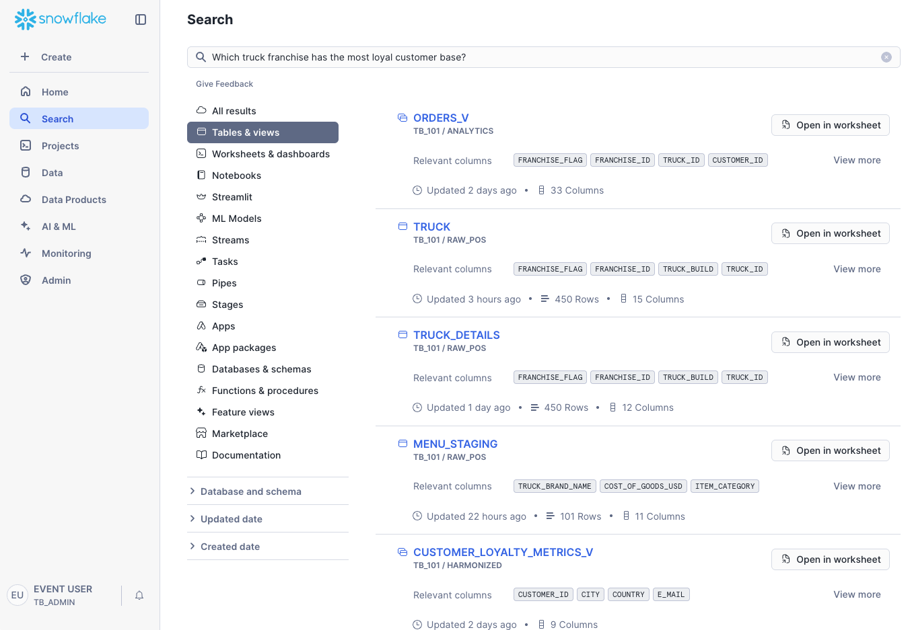

## シンプルなデータパイプライン


### 概要

このビネットでは、Snowflake でシンプルな自動化データパイプラインを構築する方法を学びます。外部ステージから生の半構造化データを取り込むところから始まり、Snowflake のダイナミックテーブルの力を使ってそのデータを変換・強化し、新しいデータが到着すると自動的に最新状態を保つパイプラインを作成します。

### 学習内容
- 外部 S3 ステージからデータを取り込む方法。
- 半構造化 VARIANT データのクエリと変換方法。
- 配列を解析するための FLATTEN 関数の使用方法。
- ダイナミックテーブルの作成と連鎖方法。
- ELT パイプラインが新しいデータを自動的に処理する仕組み。
- 有向非巡回グラフ（DAG）を使ったパイプラインの可視化方法。

### 構築するもの
- データ取り込み用の外部ステージ。
- 生データ用のステージングテーブル。
- 3 つの連鎖したダイナミックテーブルを使ったマルチステップデータパイプライン。

### SQL を取得して SQL ファイルに貼り付けます。

**この[ファイル](https://github.com/Snowflake-Labs/sfguide-getting-started-from-zero-to-snowflake/blob/main/scripts/vignette-2.sql)の SQL を新しい SQL ファイルにコピーして貼り付け、Snowflake で手順に沿って進めてください。SQL ファイルの最後まで到達したら、ステップ 16 - Snowflake Cortex AI にスキップできます。**

### 外部ステージの取り込み


#### 概要

生のメニューデータは現在、CSV ファイルとして Amazon S3 バケットに保存されています。パイプラインを開始するには、まずこのデータを Snowflake に取り込む必要があります。S3 バケットを指すステージを作成し、`COPY` コマンドを使ってデータをステージングテーブルにロードします。

#### ステップ 1 - コンテキストの設定

まず、正しいデータベース、ロール、ウェアハウスを使用するようにセッションコンテキストを設定します。SQL ファイルの最初のいくつかのクエリを実行します。

```sql
ALTER SESSION SET query_tag = '{"origin":"sf_sit-is","name":"tb_zts","version":{"major":1, "minor":1},"attributes":{"is_quickstart":1, "source":"tastybytes", "vignette": "data_pipeline"}}';

USE DATABASE tb_101;
USE ROLE tb_data_engineer;
USE WAREHOUSE tb_de_wh;
```

#### ステップ 2 - ステージとステージングテーブルの作成

ステージは外部データファイルが保存されている場所を指定する Snowflake オブジェクトです。パブリック S3 バケットを指すステージを作成します。次に、この生データを保持するテーブルを作成します。

```sql
-- メニューステージを作成
CREATE OR REPLACE STAGE raw_pos.menu_stage
COMMENT = 'Stage for menu data'
URL = 's3://sfquickstarts/frostbyte_tastybytes/raw_pos/menu/'
FILE_FORMAT = public.csv_ff;

CREATE OR REPLACE TABLE raw_pos.menu_staging
(
    menu_id NUMBER(19,0),
    menu_type_id NUMBER(38,0),
    menu_type VARCHAR(16777216),
    truck_brand_name VARCHAR(16777216),
    menu_item_id NUMBER(38,0),
    menu_item_name VARCHAR(16777216),
    item_category VARCHAR(16777216),
    item_subcategory VARCHAR(16777216),
    cost_of_goods_usd NUMBER(38,4),
    sale_price_usd NUMBER(38,4),
    menu_item_health_metrics_obj VARIANT
);
```

#### ステップ 3 - ステージングテーブルへのデータコピー

ステージとテーブルが準備できたので、`COPY INTO` コマンドを使ってステージから `menu_staging` テーブルにデータをロードしましょう。

```sql
COPY INTO raw_pos.menu_staging
FROM @raw_pos.menu_stage;
```

> 
> **[COPY INTO TABLE](https://docs.snowflake.com/en/sql-reference/sql/copy-into-table)**: この強力なコマンドはステージされたファイルから Snowflake テーブルにデータをロードします。これは一括データ取り込みの主要な方法です。

### 半構造化データ


#### 概要

Snowflake はネイティブの `VARIANT` データ型を使用して JSON などの半構造化データの処理に優れています。取り込んだカラムの 1 つ `menu_item_health_metrics_obj` には JSON が含まれています。クエリ方法を探ってみましょう。

#### ステップ 1 - VARIANT データのクエリ

生の JSON を見てみましょう。ネストされたオブジェクトと配列が含まれています。

```sql
SELECT menu_item_health_metrics_obj FROM raw_pos.menu_staging;
```

特別な構文を使って JSON 構造をナビゲートできます。コロン（`:`）は名前でキーにアクセスし、角括弧（`[]`）はインデックスで配列要素にアクセスします。`CAST` 関数またはダブルコロン（`::`）の省略記法を使って結果を明示的なデータ型にキャストすることもできます。

```sql
SELECT
    menu_item_name,
    CAST(menu_item_health_metrics_obj:menu_item_id AS INTEGER) AS menu_item_id, -- 'AS' を使ったキャスト
    menu_item_health_metrics_obj:menu_item_health_metrics[0]:ingredients::ARRAY AS ingredients -- ダブルコロン (::) 構文を使ったキャスト
FROM raw_pos.menu_staging;
```

#### ステップ 2 - FLATTEN を使った配列の解析

`FLATTEN` 関数は配列をアンネストするための強力なツールです。配列内の各要素に対して新しい行を生成します。すべてのメニュー項目のすべての食材のリストを作成するために使用してみましょう。

```sql
SELECT
    i.value::STRING AS ingredient_name,
    m.menu_item_health_metrics_obj:menu_item_id::INTEGER AS menu_item_id
FROM
    raw_pos.menu_staging m,
    LATERAL FLATTEN(INPUT => m.menu_item_health_metrics_obj:menu_item_health_metrics[0]:ingredients::ARRAY) i;
```

> 
> **[半構造化データ型](https://docs.snowflake.com/en/sql-reference/data-types-semistructured)**: Snowflake の VARIANT、OBJECT、ARRAY 型を使用すると、厳密なスキーマを事前に定義することなく、半構造化データを直接保存してクエリできます。

### ダイナミックテーブル


#### 概要

フランチャイズは常に新しいメニュー項目を追加しています。この新しいデータを自動的に処理する方法が必要です。そのために、クエリの結果を宣言的に定義し、Snowflake がリフレッシュを処理することでデータ変換パイプラインを簡素化するよう設計された強力なツール「ダイナミックテーブル」を使用できます。

#### ステップ 1 - 最初のダイナミックテーブルの作成

ステージングテーブルからすべてのユニークな食材を抽出するダイナミックテーブルを作成することから始めます。`LAG` を「1 分」に設定します。これにより、このテーブルのデータがソースデータから遅れることができる最大時間が Snowflake に伝えられます。

```sql
CREATE OR REPLACE DYNAMIC TABLE harmonized.ingredient
    LAG = '1 minute'
    WAREHOUSE = 'TB_DE_WH'
AS
    SELECT
    ingredient_name,
    menu_ids
FROM (
    SELECT DISTINCT
        i.value::STRING AS ingredient_name, 
        ARRAY_AGG(m.menu_item_id) AS menu_ids
    FROM
        raw_pos.menu_staging m,
        LATERAL FLATTEN(INPUT => menu_item_health_metrics_obj:menu_item_health_metrics[0]:ingredients::ARRAY) i
    GROUP BY i.value::STRING
);
```

> 
> **[ダイナミックテーブル](https://docs.snowflake.com/en/user-guide/dynamic-tables-about)**: ダイナミックテーブルは、基礎となるソースデータが変更されると自動的にリフレッシュされ、手動介入や複雑なスケジューリングなしに ELT パイプラインを簡素化してデータの新鮮さを確保します。

#### ステップ 2 - 自動リフレッシュのテスト

自動化を実際に確認しましょう。あるトラックが新しい食材（フランスバゲットとピクルス大根）を含むバインミーサンドイッチを追加しました。この新しいメニュー項目をステージングテーブルに挿入しましょう。

```sql
INSERT INTO raw_pos.menu_staging 
SELECT 
    10101, 15, 'Sandwiches', 'Better Off Bread', 157, 'Banh Mi', 'Main', 'Cold Option', 9.0, 12.0,
    PARSE_JSON('{"menu_item_health_metrics": [{"ingredients": ["French Baguette","Mayonnaise","Pickled Daikon","Cucumber","Pork Belly"],"is_dairy_free_flag": "N","is_gluten_free_flag": "N","is_healthy_flag": "Y","is_nut_free_flag": "Y"}],"menu_item_id": 157}');
```

`harmonized.ingredient` テーブルをクエリします。1 分以内に新しい食材が自動的に表示されるはずです。

```sql
-- 最大 1 分待ってからこのクエリを再実行する必要がある場合があります
SELECT * FROM harmonized.ingredient 
WHERE ingredient_name IN ('French Baguette', 'Pickled Daikon');
```

### パイプラインの構築


#### 概要

他のダイナミックテーブルから読み取るダイナミックテーブルをさらに作成することで、マルチステップパイプラインを構築できます。これにより、ソースから最終出力まで更新が自動的に流れるチェーン（有向非巡回グラフ＝DAG）が作成されます。

#### ステップ 1 - ルックアップテーブルの作成

食材をそれが使用されているメニュー項目にマッピングするルックアップテーブルを作成しましょう。このダイナミックテーブルは `harmonized.ingredient` ダイナミックテーブルから読み取ります。

```sql
CREATE OR REPLACE DYNAMIC TABLE harmonized.ingredient_to_menu_lookup
    LAG = '1 minute'
    WAREHOUSE = 'TB_DE_WH'   
AS
SELECT
    i.ingredient_name,
    m.menu_item_health_metrics_obj:menu_item_id::INTEGER AS menu_item_id
FROM
    raw_pos.menu_staging m,
    LATERAL FLATTEN(INPUT => m.menu_item_health_metrics_obj:menu_item_health_metrics[0]:ingredients) f
JOIN harmonized.ingredient i ON f.value::STRING = i.ingredient_name;
```

#### ステップ 2 - トランザクションデータの追加

注文テーブルにレコードを挿入して、バインミーサンドイッチ 2 つの注文をシミュレートしましょう。

```sql
INSERT INTO raw_pos.order_header
SELECT 
    459520441, 15, 1030, 101565, null, 200322900,
    TO_TIMESTAMP_NTZ('08:00:00', 'hh:mi:ss'),
    TO_TIMESTAMP_NTZ('14:00:00', 'hh:mi:ss'),
    null, TO_TIMESTAMP_NTZ('2022-01-27 08:21:08.000'),
    null, 'USD', 14.00, null, null, 14.00;
    
INSERT INTO raw_pos.order_detail
SELECT
    904745311, 459520441, 157, null, 0, 2, 14.00, 28.00, null;
```

#### ステップ 3 - 最終パイプラインテーブルの作成

最後に、最終のダイナミックテーブルを作成します。これは注文データと食材ルックアップテーブルを結合して、トラックごとの月次食材使用量のサマリーを作成します。このテーブルは他のダイナミックテーブルに依存しており、パイプラインを完成させます。

```sql
CREATE OR REPLACE DYNAMIC TABLE harmonized.ingredient_usage_by_truck 
    LAG = '2 minute'
    WAREHOUSE = 'TB_DE_WH'  
    AS 
    SELECT
        oh.truck_id,
        EXTRACT(YEAR FROM oh.order_ts) AS order_year,
        MONTH(oh.order_ts) AS order_month,
        i.ingredient_name,
        SUM(od.quantity) AS total_ingredients_used
    FROM
        raw_pos.order_detail od
        JOIN raw_pos.order_header oh ON od.order_id = oh.order_id
        JOIN harmonized.ingredient_to_menu_lookup iml ON od.menu_item_id = iml.menu_item_id
        JOIN harmonized.ingredient i ON iml.ingredient_name = i.ingredient_name
        JOIN raw_pos.location l ON l.location_id = oh.location_id
    WHERE l.country = 'United States'
    GROUP BY
        oh.truck_id,
        order_year,
        order_month,
        i.ingredient_name
    ORDER BY
        oh.truck_id,
        total_ingredients_used DESC;
```

#### ステップ 4 - 最終出力のクエリ

パイプラインの最終テーブルをクエリしましょう。リフレッシュが完了するまで数分待つと、前のステップで挿入した注文のバインミー 2 つの食材使用量が表示されます。パイプライン全体が自動的に更新されました。

```sql
-- 最大 2 分待ってからこのクエリを再実行する必要がある場合があります
SELECT
    truck_id,
    ingredient_name,
    SUM(total_ingredients_used) AS total_ingredients_used
FROM
    harmonized.ingredient_usage_by_truck
WHERE
    order_month = 1
    AND truck_id = 15
GROUP BY truck_id, ingredient_name
ORDER BY total_ingredients_used DESC;
```

### パイプラインの可視化


#### 概要

最後に、パイプラインの有向非巡回グラフ（DAG）を可視化しましょう。DAG はデータがテーブルを通じてどのように流れるかを示し、パイプラインの健全性とラグを監視するために使用できます。

#### ステップ 1 - グラフビューへのアクセス

Snowsight で DAG にアクセスするには：

1.  **Data** » **Database** に移動します。
2.  データベースオブジェクトエクスプローラーで、データベース **TB_101** とスキーマ **HARMONIZED** を展開します。
3.  **Dynamic Tables** をクリックします。
4.  作成したダイナミックテーブルのいずれか（例：`INGREDIENT_USAGE_BY_TRUCK`）を選択します。
5.  メインウィンドウの **Graph** タブをクリックします。

パイプラインの可視化が表示され、ベーステーブルからダイナミックテーブルへのデータフローが示されます。

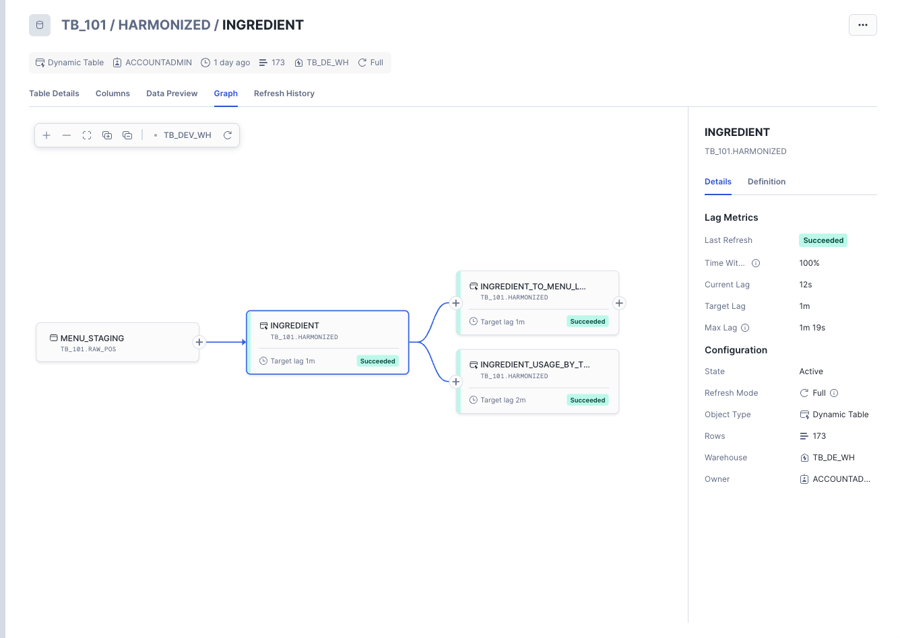

## Snowflake Cortex AI


### 概要

Snowflake Cortex AI に焦点を当てた Zero to Snowflake ガイドへようこそ！

このガイドでは、Cortex Playground による AI 実験から統合ビジネスインテリジェンスへの段階的な旅を通じて、Snowflake の完全な AI プラットフォームを探索します。Cortex Playground を使った AI 実験、本番スケールの分析のための Cortex AI 関数、セマンティックテキスト検索のための Cortex Search、自然言語分析のための Cortex Analyst を使って AI 機能を学びます。

- Snowflake Cortex AI の詳細については、[Snowflake AI および ML 概要ドキュメント](https://docs.snowflake.com/en/guides-overview-ai-features)を参照してください。

### 学習内容

* モデルテストとプロンプト最適化のために AI Cortex Playground を使って AI を実験する方法。
* 本番スケールの顧客レビュー処理のために Cortex AI 関数を使って AI 分析をスケールする方法。
* インテリジェントなテキストおよびレビュー検索のために Cortex Search を使ってセマンティック検索を有効にする方法。
* 自然言語によるビジネスインテリジェンスのために Cortex Analyst を使って会話型分析を作成する方法。

### 構築するもの

この旅を通じて、完全なインテリジェント顧客分析プラットフォームを構築します：

**フェーズ 1: AI 基盤**
* モデルテストと最適化のために Cortex Playground を使った AI 実験環境。
* 体系的な顧客フィードバック処理のために Cortex AI 関数を使った本番スケールのレビュー分析パイプライン。

**フェーズ 2: インテリジェントな開発と検索**
* 即座の顧客フィードバック検索と運用インテリジェンスのために Cortex Search を使ったセマンティック検索エンジン。

**フェーズ 3: 会話型インテリジェンス**
* 会話型データ探索のために Cortex Analyst を使った自然言語ビジネス分析インターフェース。
* 顧客の声とビジネスパフォーマンスを結びつける Snowflake Intelligence を使った統合 AI ビジネスインテリジェンスプラットフォーム。

### Cortex Playground


#### 概要

Tasty Bytes のデータアナリストとして、AI モデルを使って顧客フィードバックを迅速に探索し、サービス改善の機会を特定する必要があります。従来、AI の実験は複雑で時間がかかります。**[Snowflake Cortex Playground](https://docs.snowflake.com/en/user-guide/snowflake-cortex/cortex-playground)** は、Snowflake の UI 内で直接、多様な AI モデルを試し、実際のビジネスデータでのパフォーマンスを比較し、成功したアプローチを本番対応 SQL としてエクスポートするための迅速でセキュアな環境を提供することでこれを解決します。このモジュールでは、迅速なプロトタイピングと AI をデータワークフローにシームレスに統合するために Cortex Playground を使用する方法を案内します。


#### ステップ 1 - データへの接続とフィルタリング

Cortex Playground 内で顧客レビューデータに直接接続することから始めましょう。これにより、Snowflake 内でデータを安全に保ちながら、AI モデルを使ってフィードバックを分析できます。

**ナビゲーション手順：**

1.  **AI & ML → Cortex AI → AI Studio → Cortex Playground** に移動します。
2.  **Role: TB_DEV** と **Warehouse: TB_DEV_WH** を選択します。
3.  プロンプトボックスの「**+Connect your data**」をクリックします。
4.  データソースを選択：
      * **Database: TB_101**
      * **Schema: HARMONIZED**
      * **Table: TRUCK_REVIEWS_V**
5.  **Let's go** をクリックします。
6.  テキストカラム：**REVIEW** を選択します。
7.  フィルターカラム：**TRUCK_BRAND_NAME** を選択します。
8.  **Done** をクリックします。
9.  システムプロンプトボックスで、**TRUCK_BRAND_NAME** ドロップダウンを使ってフィルターを適用します。各トラックブランドに複数のレビューがあります。例えば「**Better Of Bread**」を選択してレビューを絞り込むことができます。「**Better Of Bread**」が利用できない場合は、ドロップダウンから他のトラックブランドを選んでそのレビューで進めてください。


> **達成したこと：** AI インターフェース内で顧客レビューデータに直接アクセスできるようになりました。フィルターにより特定のトラックブランドに分析を絞り込むことができ、実験をより的確で関連性の高いものにします。

#### ステップ 2 - インサイトのための AI モデル比較

顧客レビューを分析して特定の運用インサイトを抽出し、異なる AI モデルがこのビジネスタスクでどのようなパフォーマンスを示すかを比較しましょう。

**モデル比較の設定：**

1.  「**Compare**」をクリックして並列モデル比較を有効にします。
2.  左パネルを「**claude-sonnet-4-6**」、右パネルを「**snowflake-llama-3.3-70b**」に設定します。

> **注意：** Snowflake Cortex は、Anthropic、OpenAI、Meta などの複数のプロバイダーから主要な AI モデルへのアクセスを提供し、ベンダーロックインなしに選択肢と柔軟性を提供します。

**次の戦略的プロンプトを入力：**

 `Analyze this customer review across multiple dimensions: sentiment score with confidence level, key theme extraction, competitive positioning insights, operational impact assessment, and priority ranking for management action`

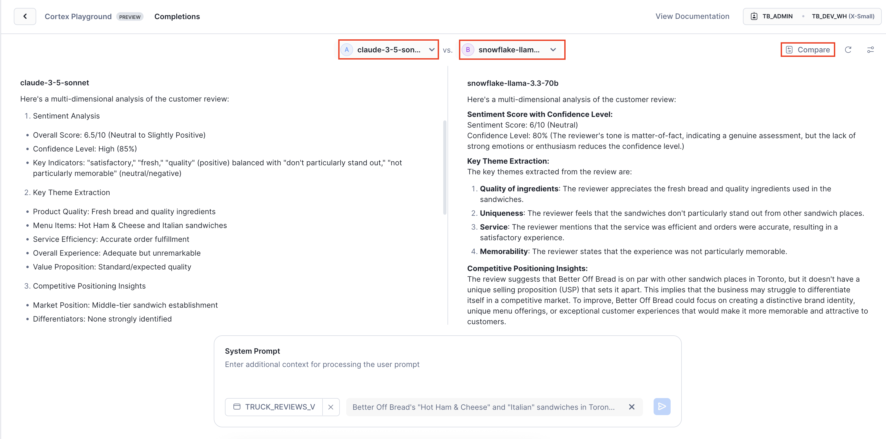

> **主要インサイト：** 明確な強みの違いに注目してください。Claude は明確な信頼性を持つ構造化されたエグゼクティブ向け分析を提供します。対して、堅牢なビジネスインテリジェンス向けに特別に最適化された Snowflake の Llama モデルは、戦略的コンテキストと詳細な競合分析が豊富な包括的な運用インテリジェンスを提供します。これは複数の AI プロバイダーを活用する力を示しており、特定のビジネスニーズに最適なアプローチを選択できます。

最適なモデルが特定されたので、さまざまなビジネスシナリオに向けてその動作を微調整する必要があります。同じモデルでも設定によって大きく異なる結果が生成されます。特定の分析要件に合わせて最適化しましょう。

#### ステップ 3 - モデル動作の微調整

「**temperature**」などのパラメーターを調整すると、AI モデルの応答にどのような影響があるかを観察します。より一貫した回答になるのか、それともよりクリエイティブな回答になるのかを確認しましょう。

**温度テストのセットアップ：**

1.  まず、両方のパネルが「**claude-sonnet-4-6**」に設定されていることを確認します。設定が異なる同じモデルを比較しています。
2.  次に、「**Compare**」の横にある「**Change Settings**」をクリックします。
3.  各サイドのパラメーターを調整します：
      * **左パネル：**
          * **Temperature** を **0.1** に設定します。これにより、モデルは非常に一貫した予測可能な回答を提供します。
          * **Max-tokens** を **200** に設定します。応答が長くなりすぎないようにします。
      * **右パネル：**
          * **Temperature** を **0.8** に設定します。モデルの回答がより創造的で多様になります。
          * **top_p** を **0.8** に設定します。応答でより幅広い語彙の使用を促す別の設定です。
          * **Max-tokens** を **200** に設定します。長さを制御するためです。
4.  ステップ 2 で使用した戦略的プロンプトをまったく同じように使用します。

試してみて、応答がどのように異なるかを確認してください。わずかな調整が AI の「個性」を変える様子は非常に興味深いです。

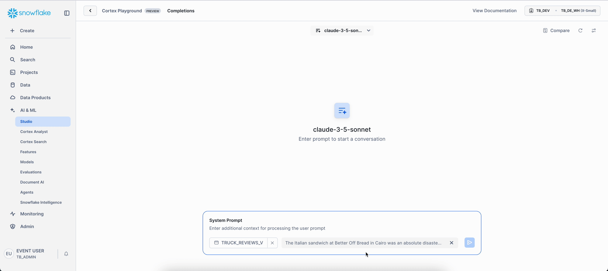

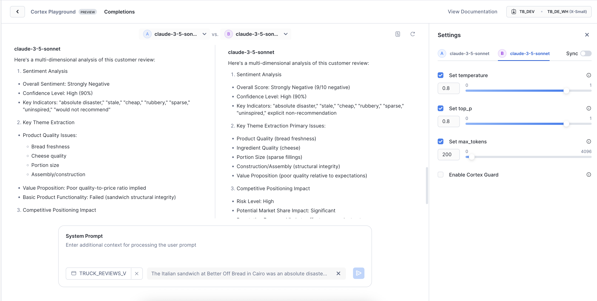

**影響の観察：**

温度パラメーターの調整が、同じ AI モデルとデータでも分析出力を根本的に変える様子に注目してください。

  * **Temperature 0.1：** 決定論的でフォーカスされた出力を生成します。構造化された一貫した分析と標準化されたレポートに最適です。
  * **Temperature 0.8：** 多様で変化に富んだ出力をもたらします。説明的なインサイトの生成や、あまり明白でない関連性の探索に最適です。

温度がトークンの選択に影響を与える一方、右側に設定した **top_p**（0.8）は可能なトークンを制限します。**max_tokens** は最大応答長を設定するだけです。小さい値は結果を切り詰める可能性があることに注意してください。これにより、AI の創造性と一貫性を精密にコントロールし、分析目的に合わせて AI の動作を調整できます。

モデル選択とパラメーター最適化をマスターしたので、この実験を可能にする基礎技術を確認しましょう。これにより、プレイグラウンドテストから本番展開への移行が容易になります。

#### ステップ 4 - 基礎技術の理解

このセクションでは、AI インサイトをプレイグラウンドから本番環境に移行するためのコア技術を探ります。

#### 基盤：コアとしての SQL

Cortex Playground で生成するすべての AI インサイトは単なる魔法ではなく、SQL に裏付けられています。モデルの応答後に「**View Code**」をクリックすると、温度などの指定した設定を含む正確な SQL クエリが表示されます。これは単なる見せ物ではありません。このコードはすぐに使えます！Workspace SQL ファイルで直接実行したり、ストリームとタスクで自動化したり、ライブデータ処理のためにダイナミックテーブルと統合したりできます。また、この Cortex Complete の機能は Python または REST API を介してプログラム的にアクセスできることも注目に値します。

#### AI_COMPLETE 関数

実行したすべてのプロンプトの裏では、**[AI_COMPLETE](https://docs.snowflake.com/en/sql-reference/functions/ai_complete)** 関数が機能しています。これは Snowflake Cortex AI の強力な関数で、テキスト補完のための業界トップクラスの大規模言語モデルへの直接アクセスを提供します。Cortex Playground は、これらのモデルを SQL に直接埋め込む前にテストして比較するための直感的なインターフェースを提供します。（注：AI_COMPLETE は SNOWFLAKE.CORTEX.COMPLETE の更新版です）

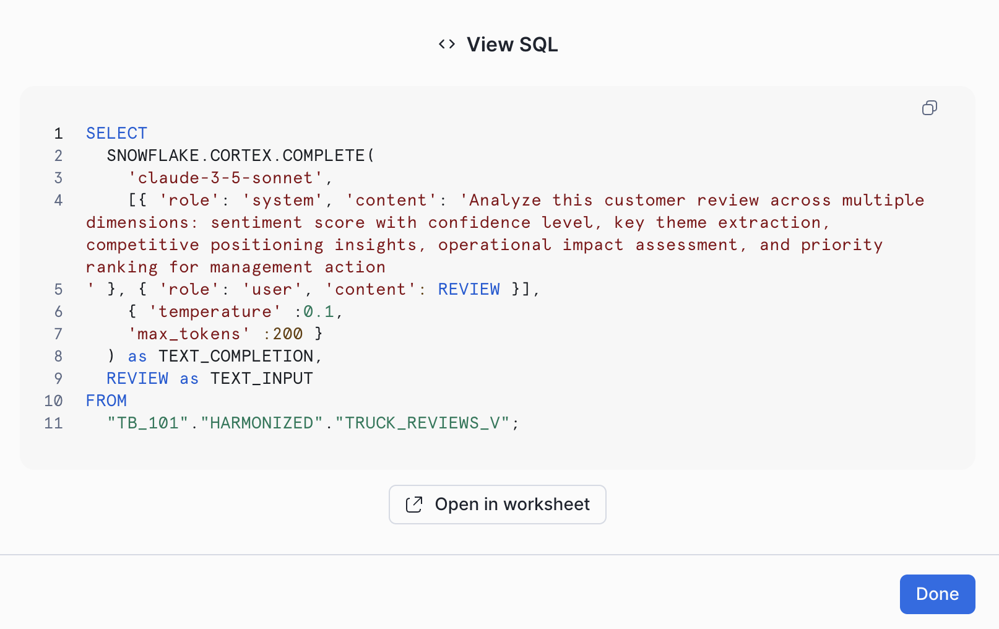

このシームレスな統合により、AI の実験が Snowflake 内の本番対応ワークフローに直接変換されます。

#### まとめ

Cortex Playground は個々のレビューを実験するための貴重なツールですが、真のラージスケール顧客フィードバック分析には特化した AI 関数が必要です。ここで洗練させたプロンプトパターンとモデル選択は、スケーラブルなソリューション構築の基盤となります。次のステップでは、**AI_SENTIMENT()**、**AI_CLASSIFY()**、**AI_EXTRACT()**、**AI_SUMMARIZE_AGG()** などの専用 AI 関数を使って何千ものレビューを処理します。この体系的なアプローチにより、AI 主導のインサイトが運用戦略のコアな部分としてシームレスに組み込まれます。

### AI 関数


#### 概要

Cortex Playground で AI モデルを使って個々の顧客レビューを分析することに成功しました。今度はスケールアップする時です！このガイドでは、**[AI 関数](https://docs.snowflake.com/en/user-guide/snowflake-cortex/aisql)** を使って何千ものレビューを処理し、実験的なインサイトを本番対応インテリジェンスに変換する方法を示します。以下を学びます：

1.  **AI_SENTIMENT()** を使用してトラックの顧客レビューにスコアとラベルを付ける。
2.  **AI_CLASSIFY()** を使用してレビューをテーマ別に分類する。
3.  **AI_EXTRACT()** を使用して特定の苦情や称賛を抽出する。
4.  **AI_SUMMARIZE_AGG()** を使用してトラックブランドごとの簡単なサマリーを生成する。

### SQL コードを取得して SQL ファイルに貼り付けます。

この[ファイル](https://github.com/Snowflake-Labs/sfguide-getting-started-from-zero-to-snowflake/blob/main/scripts/vignette-3-aisql.sql)の SQL を新しい SQL ファイルにコピーして貼り付け、Snowflake で手順に沿って進めてください。

### ステップ 1 - コンテキストの設定

まず、セッションコンテキストを設定します。AISQL 関数を活用して顧客レビューからインサイトを得ることを目的として、TastyBytes のデータアナリストのロールを担います。

```sql
ALTER SESSION SET query_tag = '{"origin":"sf_sit-is","name":"tb_zts","version":{"major":1, "minor":1},"attributes":{"is_quickstart":1, "source":"tastybytes", "vignette": "aisql_functions"}}';

USE ROLE tb_analyst;
USE DATABASE tb_101;
USE WAREHOUSE tb_de_wh;
```

#### ステップ 2 - スケールでのセンチメント分析

すべてのフードトラックブランドの顧客センチメントを分析して、どのトラックが最も良いパフォーマンスをしているかを特定し、フリート全体の顧客満足度指標を作成します。Cortex Playground では個々のレビューを手動で分析しました。今度は `AI_SENTIMENT()` 関数を使って、Snowflake の公式センチメント範囲に従い、顧客レビューに -1（否定的）から +1（肯定的）のスコアを自動的に付けます。

**ビジネスの問い：** 「各トラックブランドについて顧客全体はどのような感情を持っているか？」

このクエリを実行してフードトラックネットワーク全体の顧客センチメントを分析し、フィードバックを分類してください。

```sql
SELECT
    truck_brand_name,
    COUNT(*) AS total_reviews,
    AVG(CASE WHEN sentiment >= 0.5 THEN sentiment END) AS avg_positive_score,
    AVG(CASE WHEN sentiment BETWEEN -0.5 AND 0.5 THEN sentiment END) AS avg_neutral_score,
    AVG(CASE WHEN sentiment <= -0.5 THEN sentiment END) AS avg_negative_score
FROM (
    SELECT
        truck_brand_name,
        SNOWFLAKE.CORTEX.SENTIMENT (review) AS sentiment
    FROM harmonized.truck_reviews_v
    WHERE
        language ILIKE '%en%'
        AND review IS NOT NULL
    LIMIT 10000
)
GROUP BY
    truck_brand_name
ORDER BY total_reviews DESC;
```

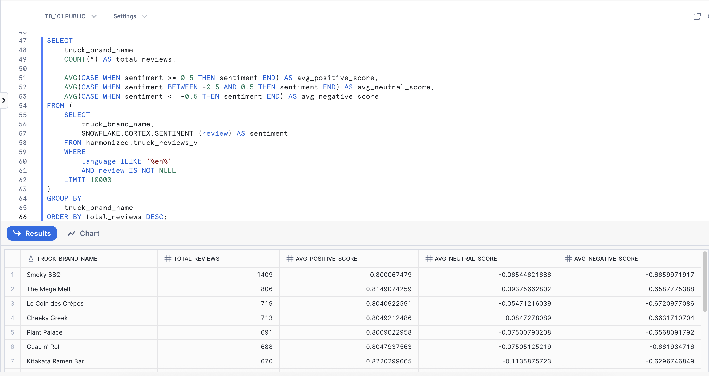


> **主要インサイト：** Cortex Playground でレビューを 1 件ずつ分析することから、何千件も体系的に処理することへの移行に注目してください。`AI_SENTIMENT()` 関数はすべてのレビューに自動的にスコアを付け、ポジティブ、ネガティブ、ニュートラルに分類しました。これにより、フリート全体の顧客満足度指標が即座に得られます。
>
> **センチメントスコア範囲：**
>
>   * ポジティブ：0.5 ～ 1
>   * ニュートラル：-0.5 ～ 0.5
>   * ネガティブ：-0.5 ～ -1

#### ステップ 3 - 顧客フィードバックの分類

すべてのレビューを分類して、顧客がサービスのどの側面について最も多く話しているかを理解しましょう。`AI_CLASSIFY()` 関数を使用します。この関数は、単純なキーワードマッチングではなく、AI の理解に基づいてレビューをユーザー定義のカテゴリに自動的に分類します。このステップでは、顧客フィードバックをビジネス関連の運用エリアに分類し、その分布パターンを分析します。

**ビジネスの問い：** 「顧客は主に何についてコメントしているか？食品の品質、サービス、それとも配達体験？」

分類クエリを実行：

```sql
WITH classified_reviews AS (
  SELECT
    truck_brand_name,
    AI_CLASSIFY(
      review,
      ['Food Quality', 'Pricing', 'Service Experience', 'Staff Behavior']
    ):labels[0] AS feedback_category
  FROM
    harmonized.truck_reviews_v
  WHERE
    language ILIKE '%en%'
    AND review IS NOT NULL
    AND LENGTH(review) > 30
  LIMIT
    10000
)
SELECT
  truck_brand_name,
  feedback_category,
  COUNT(*) AS number_of_reviews
FROM
  classified_reviews
GROUP BY
  truck_brand_name,
  feedback_category
ORDER BY
  truck_brand_name,
  number_of_reviews DESC;
```

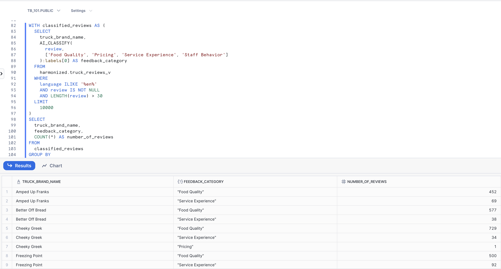


> **主要インサイト：** `AI_CLASSIFY()` が何千ものレビューを食品品質、サービス体験などのビジネス関連テーマに自動的に分類した様子に注目してください。食品品質がトラックブランド全体で最も多く議論されているトピックであることが即座にわかり、運用チームに顧客の優先事項への明確で実行可能なインサイトを提供します。

#### ステップ 4 - 特定インサイトの抽出

次に、非構造化テキストから正確な回答を得るために `AI_EXTRACT()` 関数を使用します。この強力な関数により、顧客フィードバックについて特定のビジネス質問をして直接的な回答を受け取ることができます。このステップでは、顧客レビューに記載されている正確な運用上の問題を特定し、即時対応が必要な具体的な問題を浮き彫りにすることを目標とします。

**ビジネスの問い：** 「このレビューで言及されている具体的な改善点や苦情は何か？」

次のクエリを実行しましょう：

```sql
  SELECT
    truck_brand_name,
    primary_city,
    LEFT(review, 100) || '...' AS review_preview,
    SNOWFLAKE.CORTEX.EXTRACT_ANSWER(
        review,
        'What specific improvement or complaint is mentioned in this review?'
    ) AS specific_feedback
FROM
    harmonized.truck_reviews_v
WHERE
    language = 'en'
    AND review IS NOT NULL
    AND LENGTH(review) > 50
ORDER BY truck_brand_name, primary_city ASC
LIMIT 10000;
```

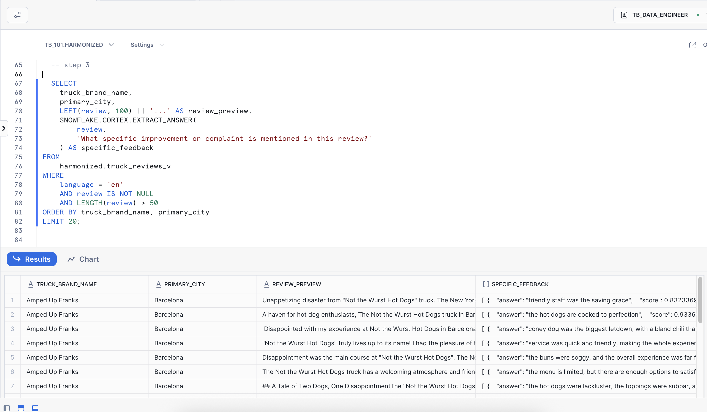


> **主要インサイト：** `AI_EXTRACT()` が長い顧客レビューから具体的で実行可能なインサイトを抽出する様子に注目してください。手動でレビューする代わりに、この関数は「friendly staff was saving grace」や「hot dogs are cooked to perfection」のような具体的なフィードバックを自動的に特定します。結果として、密度の高いテキストが運用チームが即座に活用できる具体的で引用可能なフィードバックに変換されます。

#### ステップ 5 - エグゼクティブサマリーの生成

最後に、`AI_SUMMARIZE_AGG()` 関数を使って顧客フィードバックの簡潔なサマリーを作成します。この強力な関数は長い非構造化テキストから短くまとまったサマリーを生成します。このステップでは、各トラックブランドの顧客レビューの本質を消化しやすいサマリーに凝縮し、全体的なセンチメントと主要ポイントの概要を素早く提供することを目標とします。

**ビジネスの問い：** 「各トラックブランドの主要テーマと全体的なセンチメントは何か？」

要約クエリを実行：

```sql
SELECT
  truck_brand_name,
  AI_SUMMARIZE_AGG (review) AS review_summary
FROM
  (
    SELECT
      truck_brand_name,
      review
    FROM
      harmonized.truck_reviews_v
    LIMIT
      100
  )
GROUP BY
  truck_brand_name;
```

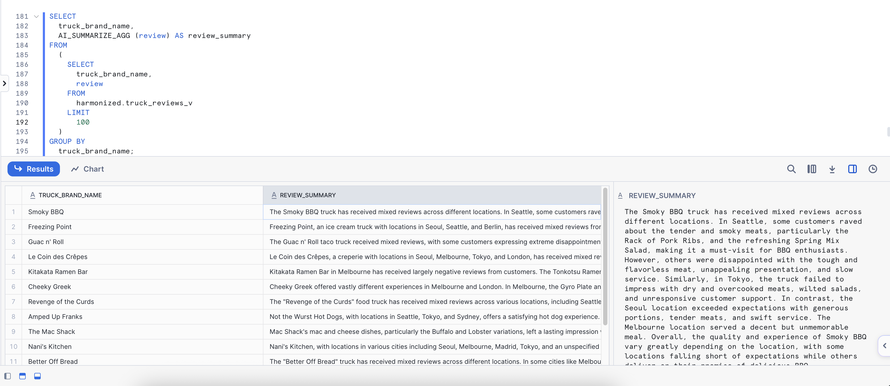

> **主要インサイト：** `AI_SUMMARIZE_AGG()` 関数は長いレビューを明確なブランドレベルのサマリーに凝縮します。これらのサマリーは繰り返されるテーマとセンチメントのトレンドを強調し、意思決定者に各フードトラックのパフォーマンスの概要を素早く提供し、個々のレビューを読むことなく顧客認識の理解を速めます。

#### まとめ

AI 関数の変革的な力を示すことに成功しました。顧客フィードバック分析が個々のレビュー処理から体系的な本番スケールのインテリジェンスへとシフトしました。これら 4 つのコア関数を通じた旅は、各関数がそれぞれ異なる分析目的を果たす様子を明確に示し、生の顧客の声を包括的なビジネスインテリジェンスに変換します。体系的で、スケーラブルで、即座に実行可能です。かつて個別のレビュー分析を必要としたものが、今では数秒で何千ものレビューを処理し、データ主導の運用改善に不可欠な感情的コンテキストと具体的な詳細の両方を提供します。

### オプション：Cortex Search


#### 概要

AI を活用したツールは複雑な分析クエリの生成に優れていますが、カスタマーサービスチームが日常的に直面する課題は、苦情や称賛のために特定の顧客レビューを素早く見つけることです。従来のキーワード検索は自然言語のニュアンスを捉えられないことが多く、不十分です。

**[Snowflake Cortex Search](https://docs.snowflake.com/en/user-guide/snowflake-cortex/cortex-search/cortex-search-overview)** は、Snowflake のテキストデータに対して低遅延・高品質な「ファジー」検索を提供することでこれを解決します。エンベディング、インフラ、チューニングを処理しながら、ハイブリッド（ベクターとキーワード）検索エンジンを素早くセットアップします。内部では、Cortex Search はセマンティック（意味ベース）とレキシカル（キーワードベース）の検索を組み合わせ、インテリジェントな再ランキングで最も関連性の高い結果を提供します。このラボでは、検索サービスを設定し、顧客レビューデータに接続して、セマンティッククエリを実行して主要な顧客フィードバックを積極的に特定します。

#### ステップ 1 - Cortex Search へのアクセス

1.  Snowsight を開き、**AI & ML → Cortex AI → Search** に移動します。
2.  **Create** をクリックしてセットアップを開始します。

これにより検索サービス設定インターフェースが開き、Snowflake がテキストデータをインデックス化して解釈する方法を定義します。

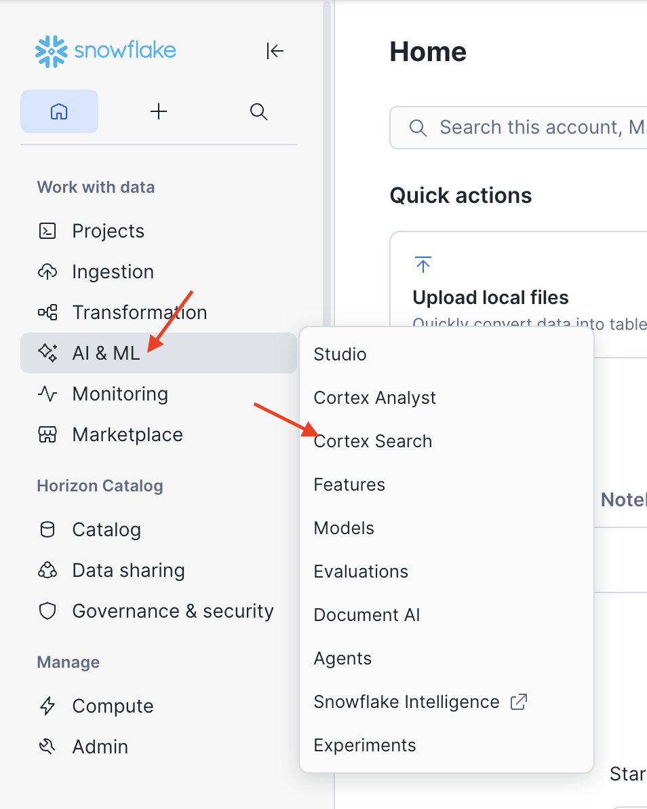

#### ステップ 2 - 検索サービスの設定

**New service** 設定画面で：

1. **Database** と **Schema** を選択：
   * Databases ドロップダウンから **TB_101** を選択
   * Schemas ドロップダウンから **HARMONIZED** を選択
2. **Service name** に入力：`customer_feedback_intelligence`
3. 右下の **Next** ボタンをクリックして次に進みます。

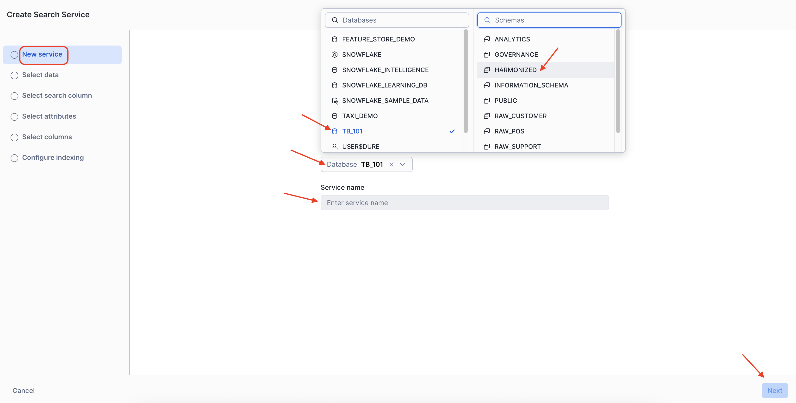


#### ステップ 3 - レビューデータへの接続

ウィザードが複数の設定画面を案内します。以下の手順に従います：

1. **Select data 画面：**
   * Views ドロップダウンから `TRUCK_REVIEWS_V` を選択
   * **Next** をクリック

2. **Select search column 画面：**
   * `REVIEW` を選択（セマンティック検索が行われるテキストカラム）
   * **Next** をクリック

3. **Select attributes 画面：**
   * 結果のフィルタリング用カラムを選択：`TRUCK_BRAND_NAME`、`PRIMARY_CITY`、`REVIEW_ID`
   * **Next** をクリック

4. **Select columns 画面：**
   * 検索結果に含める他のカラムを選択：`DATE`、`LANGUAGE` など
   * **Next** をクリック

5. **Configure indexing 画面：**
   * **Warehouse**：ドロップダウンから `COMPUTE_WH` を選択
   * 他のデフォルト設定はそのまま
   * **Create** をクリックして検索サービスを構築

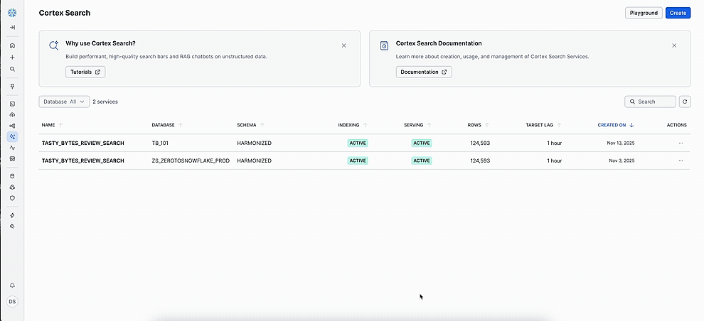

> **注意**：検索サービスの作成にはインデックスの構築が含まれるため、初期セットアップには少し時間がかかる場合があります。作成プロセスが長引く場合は、事前設定済みの検索サービスを使用してラボを継続できます：
> 

1.  Snowsight の左側メニューから **AI & ML** に移動し、**Cortex Search** をクリックします。
2.  Cortex Search ビューでドロップダウンフィルター（画像で `TB_101 / HARMONIZED` と表示）を見つけます。このフィルターが `TB_101 / HARMONIZED` に設定されていることを確認します。
3.  表示される「Search services」リストで、事前構築済みサービス **`TASTY_BYTES_REVIEW_SEARCH`** をクリックします。
4.  サービスの詳細ページに入ったら、右上の **Playground** をクリックしてラボの検索サービスの使用を開始します。

- **いずれかの検索サービスがアクティブになったら（新しいものでも事前設定済みでも）、クエリは低遅延で実行され、シームレスにスケールされます。**

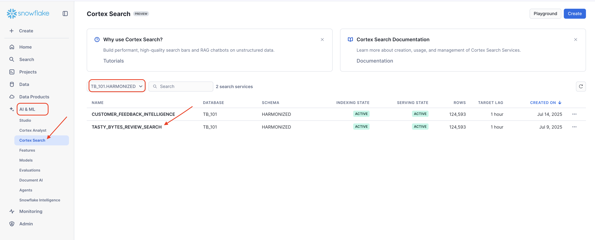

> このシンプルな UI の裏では、Cortex Search が複雑なタスクを実行しています。「REVIEW」カラムのテキストを分析し、AI モデルを使ってテキストの意味の数値表現であるセマンティックエンベディングを生成します。これらのエンベディングはインデックス化され、後で高速な概念検索が可能になります。数回クリックするだけで、Snowflake にレビューの意図を理解させることができました。

#### ステップ 4 - セマンティッククエリの実行

サービスが「Active」と表示されたら、**Playground** をクリックして検索バーに自然言語プロンプトを入力します：

**プロンプト - 1：** `Customers getting sick`（体調を崩す顧客）

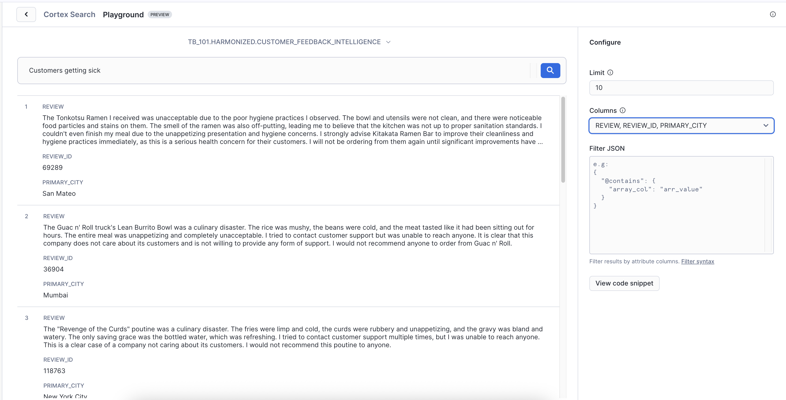

> **主要インサイト：** Cortex Search は単に顧客を見つけているのではなく、顧客を体調悪くさせる可能性がある「状況」を見つけています。これがリアクティブなキーワード検索とプロアクティブなセマンティック理解の違いです。

別のクエリを試してみましょう：

**プロンプト - 2：** `Angry customers`（怒っている顧客）

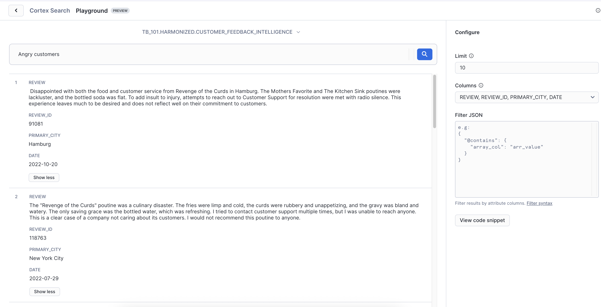

> **主要インサイト：** これらの顧客は離反しようとしていますが、「怒っている」とは一度も言っていません。彼らは自分自身の言葉で不満を表現しました。Cortex Search は言語の背後にある感情を理解し、顧客が離れる前にリスクのある顧客を特定して救うのに役立ちます。

#### まとめ

最終的に、Cortex Search は Tasty Bytes が顧客フィードバックを分析する方法を変革します。カスタマーサービスマネージャーが単にレビューを精査するだけでなく、スケールで顧客の声を真に理解してプロアクティブに行動し、より良い運用上の意思決定を推進して顧客ロイヤルティを高めることができます。

次のモジュール「Cortex Analyst」では、自然言語を使って構造化データをクエリします。

### オプション：Cortex Analyst


#### 概要

Tasty Bytes のビジネスアナリストは、セルフサービス分析を可能にする必要があります。ビジネスチームが自然言語で複雑な質問をして、データアナリストに SQL を書いてもらうことなく即座にインサイトを得られるようにすることです。以前の AI ツールはレビューの検索や複雑なクエリ生成に役立ちましたが、今求められているのは構造化されたビジネスデータから即座にインサイトを引き出す**会話型分析**です。

**[Snowflake Cortex Analyst](https://docs.snowflake.com/en/user-guide/snowflake-cortex/cortex-analyst)** は、ビジネスユーザーが自然言語インタラクションを通じて分析データから直接価値を引き出すことができます。このラボでは、セマンティックモデルの設計、ビジネスデータへの接続、関係性とシノニムの設定、そして自然言語を使った高度なビジネスインテリジェンスクエリの実行を案内します。

#### ステップ 1 - セマンティックモデルの設計

Snowsight で Cortex Analyst に移動し、セマンティックモデルの基盤を設定することから始めましょう。

1. Snowsight で **AI & ML → Cortex AI → AI Studio** の **Cortex Analyst** に移動します。

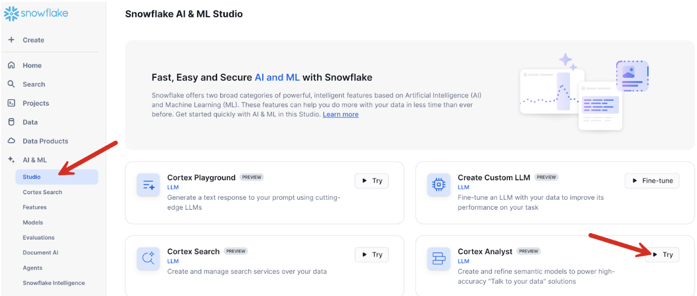

2. **ロールとウェアハウスの設定：**

    * ロールを `TB_DEV` に変更します。
    * ウェアハウスを `TB_CORTEX_WH` に設定します。

3. **Create with Copilot** ボタンをクリックします。

4. 次の画面で **Skip** をクリックします。

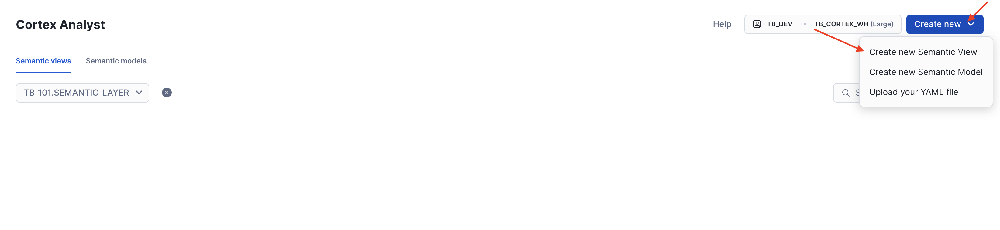

5.  **Getting Started** ページで以下を設定します：

      * **Name**: `tasty_bytes_business_analytics`
      * **DATABASE**: `TB_101`
      * **SCHEMA**: `SEMANTIC_LAYER`
      * **Next** をクリックします。

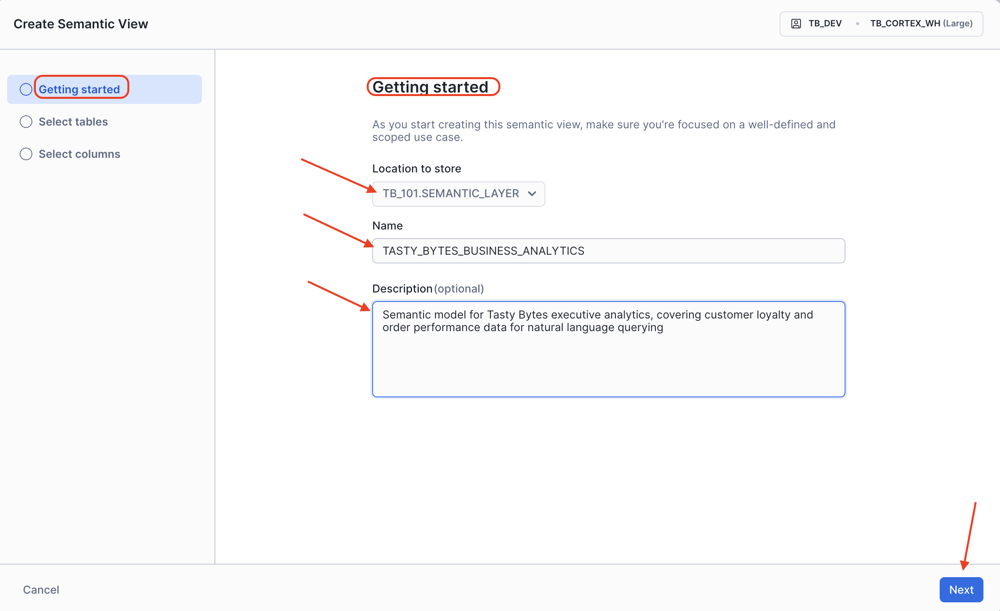

#### ステップ 2 - テーブルとカラムの選択と設定

**Select tables** ステップで、分析ビューを選択しましょう。

1.  コアビジネステーブルを選択：

      * **DATABASE**: `TB_101`
      * **SCHEMA**: `SEMANTIC_LAYER`
      * **VIEWS**: `Customer_Loyalty_Metrics_v` と `Orders_v` を選択
      * **Next** をクリックします。

2.  **Select columns** ページで、両方の選択済みテーブルがアクティブになっていることを確認し、**Create and Save** をクリックします。

#### ステップ 3 - 論理テーブルの編集とシノニムの追加

テーブルシノニムと主キーを追加して、自然言語の理解を向上させましょう。

1.  `customer_loyalty_metrics_v` テーブルで、以下のシノニムを `Synonyms` ボックスにコピーして貼り付けます：

    ```
    Customers, customer_data, loyalty, customer_metrics, customer_info
    ```

2.  **Primary Key** をドロップダウンから `customer_id` に設定します。

3.  `orders_v` テーブルには以下のシノニムをコピーして貼り付けます：

    ```
    Orders, transactions, sales, purchases, order_data
    ```

4.  変更後、右上の **Save** をクリックします。

#### ステップ 4 - テーブルリレーションシップの設定

セマンティックモデルを作成した後、論理テーブル間のリレーションシップを確立しましょう。

1.  左側のナビゲーションで **Relationships** をクリックします。

2.  **Add relationship** をクリックします。

3.  リレーションシップを以下のように設定します：

      * **Relationship name**: `orders_to_customer_loyalty_metrics`
      * **Left table**: `ORDERS_V`
      * **Right table**: `CUSTOMER_LOYALTY_METRICS_V`
      * **Join columns**: `CUSTOMER_ID` = `CUSTOMER_ID` に設定。

4.  **Add relationship** をクリックします。

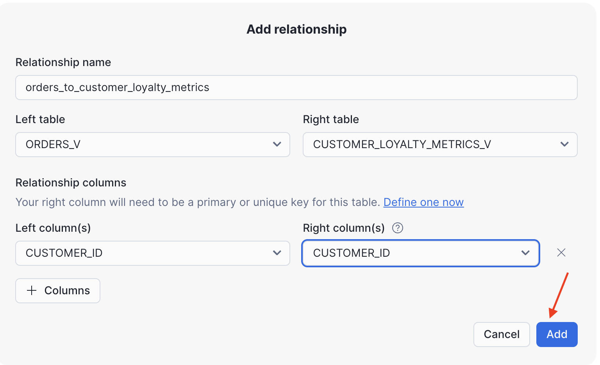

**完了後**、UI 上部の **Save** オプションを使用してください。これにより、セマンティックビューが完成し、セマンティックモデルが高度な自然言語クエリに対応できるようになります。

**Cortex Analyst のチャットインターフェース**にフルスクリーンモードでアクセスするには：

1.  右上の「Share」ボタン横の **3 点メニュー（省略記号）** をクリックします。
2.  ドロップダウンメニューから **「Enter fullscreen mode」** を選択します。

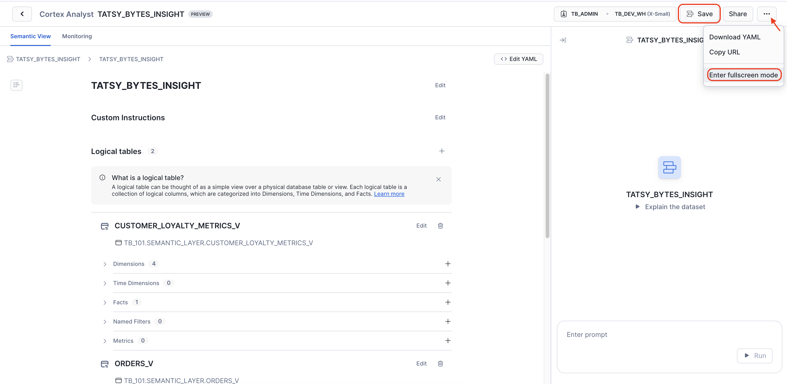

#### ステップ 5 - 顧客セグメンテーションインテリジェンスの実行

セマンティックモデルとリレーションシップがアクティブになったので、最初の複雑なビジネスクエリを実行して高度な自然言語分析を実証しましょう。

1.  Cortex Analyst クエリインターフェースに移動します。

2.  以下のプロンプトを入力します：

    ```
    Show customer groups by marital status and gender, with their total spending per customer and average order value. Break this down by city and region, and also include the year of the orders so I can see when the spending occurred. In addition to the yearly breakdown, calculate each group's total lifetime spending and their average order value across all years. Rank the groups to highlight which demographics spend the most per year and which spend the most overall.
    ```
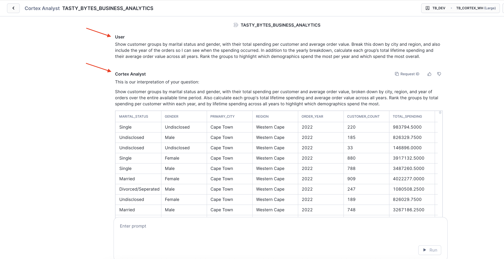

> **主要インサイト：** マルチテーブル結合、人口統計セグメンテーション、地理的インサイト、生涯価値分析を組み合わせた包括的なインテリジェンスを即座に提供します。通常 40 行以上の SQL と数時間のアナリスト作業を必要とするインサイトです。

#### ステップ 6 - 高度なビジネスインテリジェンスの生成

基本的なセグメンテーションを見た後、会話型ビジネスインテリジェンスの完全な力を示すエンタープライズグレードの SQL を実証しましょう。

1.  更新アイコンをクリックしてコンテキストをクリアします。

2.  以下のプロンプトを入力します：

    ```
    I want to understand our customer base better. Can you group customers by their total spending (high, medium, low spenders), then show me their ordering patterns differ? Also compare how our franchise locations perform versus company-owned stores for each spending group.
    ```
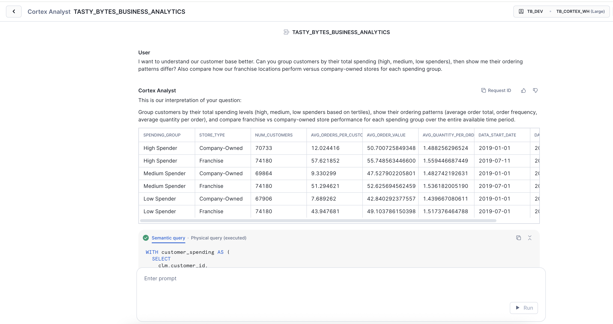


> **主要インサイト：** Cortex Analyst がビジネスユーザーのシンプルな自然言語の質問と、それに答えるために必要な高度で多面的な SQL クエリとの間のギャップをシームレスに埋める様子に注目してください。CTE、ウィンドウ関数、詳細な集計を含む複雑なロジックを自動的に構築し、通常は熟練したデータアナリストが必要な作業です。

#### まとめ

これらの厳格なステップを通じて、堅牢な Cortex Analyst セマンティックモデルを構築しました。これは単なる改善ではなく、さまざまな業界のユーザーを SQL の制約から解放し、直感的な自然言語クエリを通じて深いビジネスインテリジェンスを引き出すことができる変革的なツールです。Tasty Bytes のユースケースで示したマルチレイヤー分析は、このモデルが深いインサイトに従来必要だった時間と労力を大幅に削減し、データへのアクセスを民主化し、広範なスケールでデータに基づいた機敏な意思決定の文化を育む方法を強力に示しています。

### Snowflake Intelligence


#### 概要

Tasty Bytes の最高執行責任者（COO）は毎週、断片化した多数のレポートを受け取っています。顧客満足度ダッシュボード、収益分析、運用パフォーマンス指標、市場分析など。重要なビジネスインサイトは別々のシステムに埋もれています。顧客センチメントはレビュープラットフォームに、売上データは財務ダッシュボードに、運用指標は孤立したパフォーマンスツールに存在しています。

COO が Q3 の収益低下の原因を理解する必要がある場合、顧客フィードバックのセンチメントと実際の財務パフォーマンスを結びつけるには、手動分析、SQL の専門知識、複数のデータソースの相互参照に何時間もかかります。これはエグゼクティブや非技術的な役割にとって大きな障壁です。

このセクションでは、**[Snowflake Intelligence](https://docs.snowflake.com/en/user-guide/snowflake-cortex/snowflake-intelligence)** がこの課題に取り組む方法を示します。セットアップで利用可能になる Cortex Search と Cortex Analyst の機能を組み合わせ、単一の会話型 AI エージェントを実現します。エグゼクティブや非技術的な役割が自然言語で質問して、可視化付きの即時回答を受け取る方法を見ていきます。このようなインサイトは通常、複数のチームにまたがるアナリストの数週間の作業を必要とします。

**前提条件：**

このモジュールを開始する前に、環境には Snowflake Intelligence を動かす事前設定済みの AI サービスが含まれています：

* **Cortex Search サービス：** `tasty_bytes_review_search` - 顧客レビューとフィードバックを分析
    * *上級ユーザー向け注記：* Cortex Search をゼロから構築したい場合は、オプションのセットアップモジュールがあります。詳細ガイドは[Cortex Search モジュール](/en/developers/guides/zero-to-snowflake/)のリンクをクリックしてください。

* **Cortex Analyst サービス：** `TASTY_BYTES_BUSINESS_ANALYTICS` - 自然言語の質問を SQL に変換し、構造化データからインサイトを提供してセルフサービス分析を可能にします。
    * *上級ユーザー向け注記：* Cortex Analyst セマンティックモデルをゼロから構築したい場合は、詳細なセットアップモジュールにアクセスできます。[Cortex Analyst モジュール](/en/developers/guides/zero-to-snowflake/)をクリックしてください。

---

#### ステップ 1 - セマンティックモデルのアップロード

Snowflake Intelligence でビジネス分析機能を有効にするには、事前構築済みのセマンティックモデルファイルを Snowflake ステージにアップロードする必要があります。**このリンクをクリックして必要な YAML ファイルを直接ダウンロードできます：** [Cortex Analyst セマンティックモデル](https://github.com/Snowflake-Labs/sfguide-getting-started-from-zero-to-snowflake/blob/main/semantic_models/TASTY_BYTES_BUSINESS_ANALYTICS.yaml)

**重要：** リンクをクリックするとブラウザでファイルが開く場合は、リンクを右クリックして **「名前を付けてリンク先を保存」** を選択し、YAML ファイルをローカルマシンにダウンロードしてください。

セマンティックモデルのアップロード方法：

1.  **Cortex Analyst に移動**：Snowsight で **AI & ML → Cortex AI → AI Studio** に移動し、**Cortex Analyst** を選択します。

2.  **ロールとウェアハウスの設定**：

      * ロールを `TB_DEV` に変更します。
      * ウェアハウスを `TB_CORTEX_WH` に設定します。

3.  **YAML ファイルのアップロード**：**Upload your yaml file** ボタンをクリックします。

4.  **アップロード詳細の設定**：ファイルアップロード画面で以下を設定します：

      * **Database**: `Tb_101`
      * **Schema**: `semantic_layer`
      * **Stage**: `semantic_model_stage`

5.  **Upload をクリック**：この YAML ファイルには、顧客ロイヤルティ指標と注文データを含むビジネス分析レイヤーを定義する事前設定済みセマンティックモデルが含まれています。

6.  **YAML ファイルを保存**：アップロードをクリックした後、YAML ファイルを保存します。セマンティックモデルは Cortex Analyst パネルのセマンティックモデルセクションに表示されます。

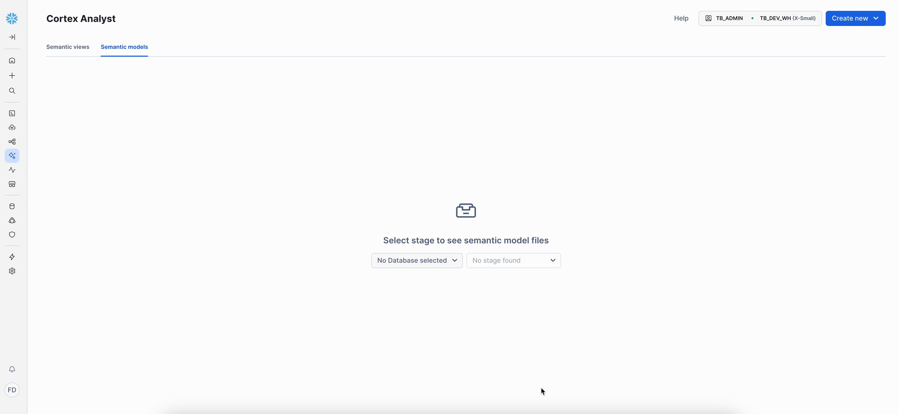

-----

#### ステップ 2：統合エージェントの作成

AI サービスが事前設定されたので、これらの機能を単一の統合インテリジェンスインターフェースに組み合わせる Cortex エージェントを作成できます。

### エージェントの作成

1.  **Snowsight** で **AI & ML Studio** に移動し、**Agents** を選択します。
2.  **Create Agent** をクリックします。
3.  「Create New Agent」ウィンドウで **Create agent** をクリックします。
4.  **初期設定**：
      * **Platform integration**：「Create this agent for Snowflake Intelligence」にチェックが入っていることを確認します。
      * **Database and schema**：デフォルトで `SNOWFLAKE_INTELLIGENCE.AGENTS` になります。
      * **Agent object name**：`tasty_bytes_intelligence_agent` と入力します。
      * **Display name**：`Tasty Bytes Business Intelligence Agent` と入力します。
5.  **Create agent** をクリックします。

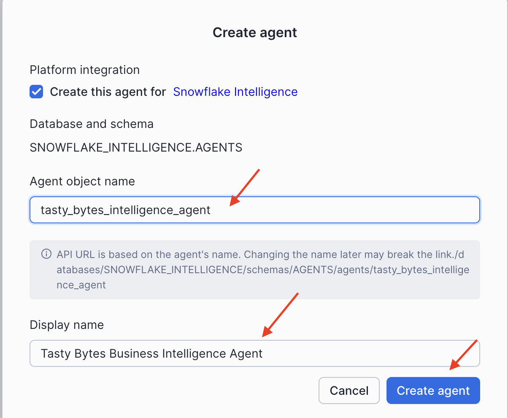

-----

### エージェントの設定

エージェントを作成した後、エージェントリストから名前をクリックして詳細ページを開き、**Edit** をクリックして設定を開始します。

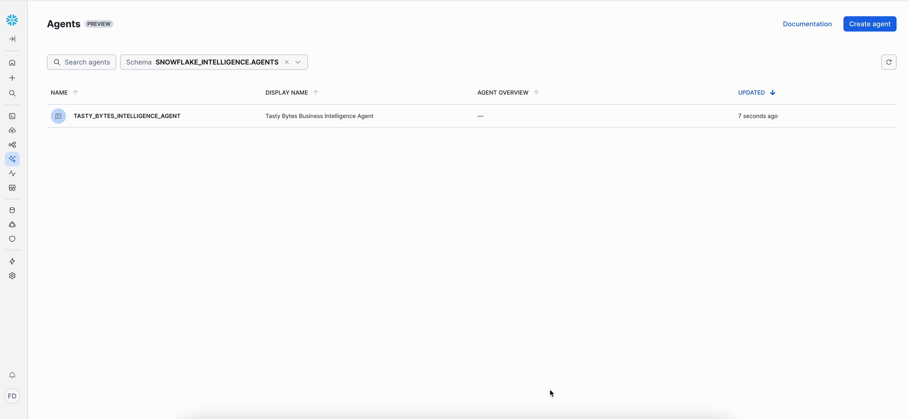

#### **1. About タブ**

  * **Display name**: `Tasty Bytes Business Intelligence Agent`
  * **Description**:
```
This agent analyzes customer feedback and business performance data for Tasty Bytes food trucks. It identifies operational issues, competitive threats, and growth opportunities by connecting customer reviews with revenue and loyalty metrics to provide actionable business insights.
```

#### **2. Tools タブ**

> **注意**：このラボでは主にステップ 1 でアップロードした事前構築済みの**セマンティックモデル**を使用します。ただし、[Cortex Analyst モジュール](vignette-3-cortex-analyst.md)を使ってゼロから Cortex Analyst セマンティックビューを構築した場合は、セマンティックモデルの代わりにここで**セマンティックビュー**を選択します。**Database** を `TB_101`、**Schema** を `semantic_layer` に設定すると、そのスキーマの下にセマンティックビューが表示されます。

ステップ 1 でアップロードしたセマンティックモデルを追加しましょう：

**Cortex Analyst ツールの追加：**

1.  「Cortex Analyst」の横にある **Add** をクリックします。
2.  **Semantic model file** ラジオボタンを選択します。
3.  **セマンティックモデルの場所を設定**：
      * **Schema**：`TB_101.SEMANTIC_LAYER` を選択します。
      * **Stage**：`SEMANTIC_MODEL_STAGE` を選択します。
      * **File Selection**：リストからアップロードした YAML ファイルを選びます。
4.  **ツールの詳細を設定**：
      * **Name**：`tasty_bytes_business_analytics` と入力します。
      * **Description**:
```
Searches customer reviews and feedback to identify sentiment, operational issues, and customer satisfaction insights
```
5.  **実行設定**：
      * **Warehouse**：**Custom** を選択して `TB_CORTEX_WH` を選びます。
      * **Query timeout**：`300` と入力します。
6.  **Add** をクリックします。


-----

**Cortex Search Services ツールの追加：**

1.  「Cortex Search Services」の横にある **Add** をクリックします。
2.  **ツールの詳細を設定**：
      * **Name**：`tasty_bytes_review_search`
      * **Description**：
``` 
Searches customer reviews and feedback to identify sentiment, operational issues, and customer satisfaction insights
``` 
3.  **データソースの場所を設定**：
      * **Schema**：`TB_101.HARMONIZED` を選択します。
      * **Search service**：`TB_101.HARMONIZED.TASTY_BYTES_REVIEW_SEARCH` を選択します。
4.  **検索結果カラムを設定**：
      * **ID column**：**Review** を選択します。
      * **Title column**：**TRUCK_BRAND_NAME** を選択します。
5.  **検索フィルターの設定（オプション）**：
      * **Add filter** をクリックして最大 5 つのオプションフィルターを追加します。
6.  **Add** をクリックします。

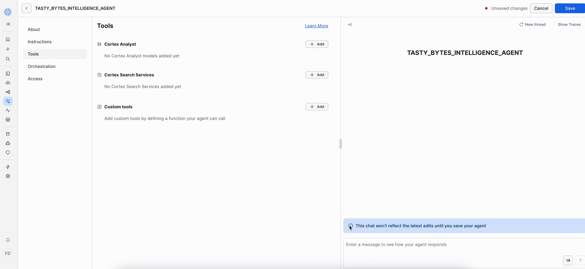

#### **3. Orchestration タブ**

* **Orchestration Instruction**：

```
Use both Cortex Search and Cortex Analyst to provide unified business intelligence.
Analyze customer feedback sentiment and operational issues from reviews, then correlate findings with revenue performance, customer loyalty metrics, and market data.
Present insights with revenue quantification and strategic recommendations.
```

* **Response Instruction**:
```
You are a business intelligence analyst for Tasty Bytes food trucks. When analyzing data:
1. Combine customer review insights with specific revenue and loyalty data to provide comprehensive business intelligence
2. Quantify business impact with specific revenue amounts and market sizes
3. Identify operational risks, competitive threats, and growth opportunities
4. Provide clear, actionable recommendations for executive decision-making
5. Use visualizations when helpful to illustrate business insights
6. Explain the correlation between customer feedback and business performance
7. Focus on strategic insights that drive business outcomes
```

#### **4. Access タブ**

> このラボでエージェントを使用できるユーザーを制御するには、テスト用に十分なデフォルトの ACCOUNTADMIN アクセスをそのまま維持します。追加設定は不要です。ただし、**Add role** をクリックして TB_ADMIN などのロールを追加することもできます。

#### **5. 設定の保存**

  * 右上の **Save** をクリックしてエージェントの設定を完了します。

統合インテリジェンスエージェントが、Snowflake Intelligence インターフェースを通じた会話型ビジネスインテリジェンスの提供に対応できるようになりました。

> **注意：** エージェントを Snowflake Intelligence に追加しようとした際に以下のエラーが表示された場合は、次の手順を実行してください。
> `You do not have MODIFY privilege to add agents to Snowflake Intelligence. Contact your administrator to grant you the necessary privileges.`
>
> **Snowflake Intelligence にエージェントを追加する手順**
>
> **前提条件：** `ACCOUNTADMIN` ロールで実行すること
>
> Snowsight の **Cortex Code** を開き、以下の SQL を実行します。
>
> **1. Snowflake Intelligence オブジェクトの作成：**
> ```sql
> CREATE SNOWFLAKE INTELLIGENCE SNOWFLAKE_INTELLIGENCE_OBJECT_DEFAULT;
> ```
>
> **2. エージェントの追加：**
> ```sql
> ALTER SNOWFLAKE INTELLIGENCE SNOWFLAKE_INTELLIGENCE_OBJECT_DEFAULT
>   ADD AGENT SNOWFLAKE_INTELLIGENCE.AGENTS.TASTY_BYTES_INTELLIGENCE_AGENT;
> ```

-----

#### ステップ 3 - Snowflake Intelligence インターフェースへのアクセス

インテリジェンスエージェントが作成されたので、統合された自然言語ビジネスインテリジェンスを提供する Snowflake Intelligence インターフェースにアクセスできます。

**インターフェースへのアクセス：**

1.  Snowsight を開き、AI & ML Studio に移動して **Snowflake Intelligence** を選択します。
2.  作成したエージェントを選択：`tasty_bytes_intelligence_agent`
3.  ソースを選択：`tasty_bytes_review_search` と `tasty_bytes_business_analytics` を選択します。

統合ビジネスインテリジェンスを自然言語でデモする準備ができました。

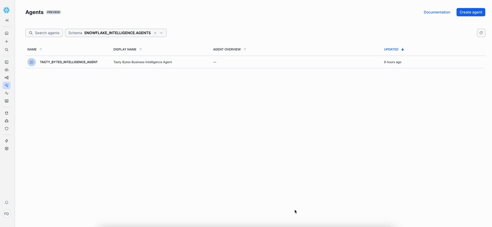
-----

#### ステップ 4 - 収益と顧客テーマの相関分析

最も収益の高い市場を深掘りして、財務的な成功と顧客の声をマッピングしましょう。

**プロンプト：**

```
Generate a bar chart displaying the top 5 cities by total revenue. For each of these top-performing cities, analyze their customer reviews to identify the 3 most frequently discussed topics or common themes (e.g., related to service, product, or facilities). Provide these topics alongside the chart
```
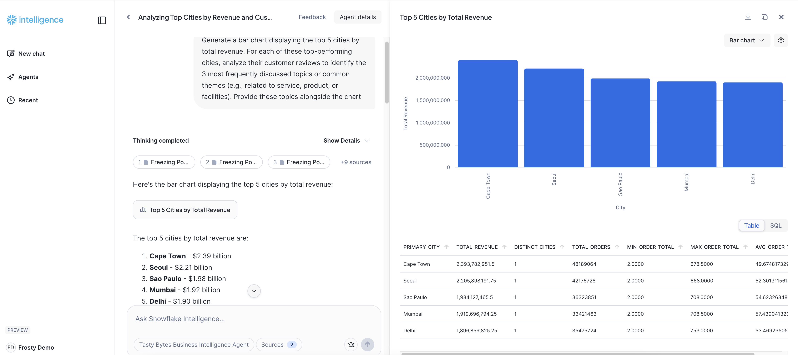

**主要インサイト：** この分析は Snowflake Intelligence の力を示しています！トップ都市の収益と、それらの都市の顧客が実際に言っていることをつなぎ合わせるのに役立ちます。収益でベストパフォーマンスの市場を素早く確認し、レビューで最も一般的なトピックの明確な全体像を得ることができます。これにより、成功を真に推進しているもの、あるいは強い地域でも潜在的な問題が醸成されていないかについて、より豊かで人間的な理解が得られます。すべては単純な質問をするだけで、これらの強力なインサイトが得られます。

#### ステップ 5 - 低パフォーマンス市場の分析

これらの重要な顧客の悩みポイントに対処し、これらの都市のパフォーマンスを改善するための的を絞ったアクションプランを作成する戦略を探りましょう。

**プロンプト：**

```
Identify the 5 cities with the lowest total revenue. For each of these cities, analyze their customer reviews to identify the 3 most frequently mentioned pain points or areas of dissatisfaction. Please present this as a table, showing the city, its total revenue, and the identified customer pain points.
```
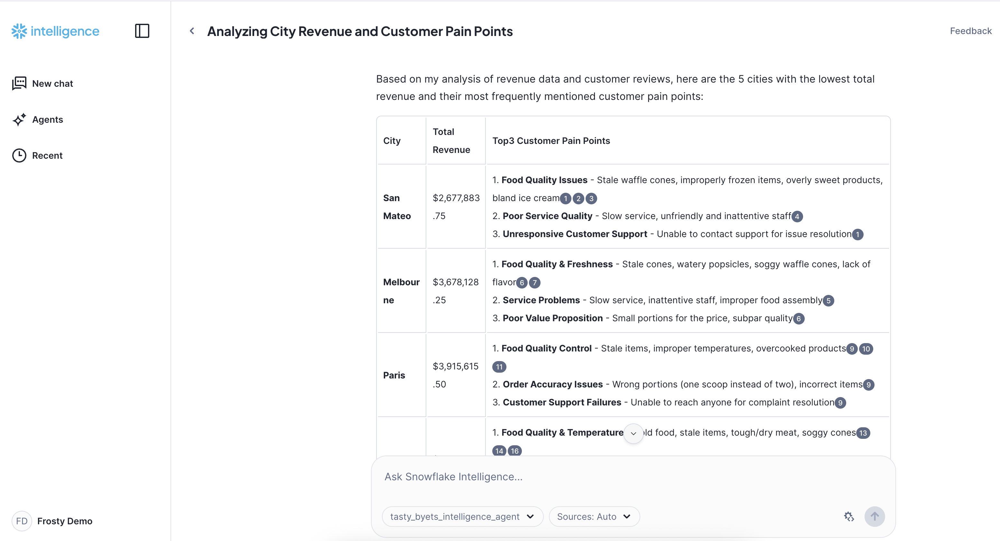

**主要インサイト：** Snowflake Intelligence からのこの分析は、最も収益の低い都市の明確な全体像を提供し、それらを阻んでいる正確な顧客の悩みポイントに光を当てます。生の収益数字と顧客レビューからの具体的なフィードバックを直接結びつけることで、サービス、製品、サポートを改善するために集中すべき場所を特定できます。これらの課題を抱える市場での成長と顧客満足を促進するための実行可能なインテリジェンスを提供し、すべて自然言語での質問によって実現されます。

-----

#### まとめ

Tasty Bytes で経験したことは、ビジネスがデータを真に理解できる方法の根本的な変化を示しています。構造化されたビジネス指標からの会話型インサイトのために Cortex Analyst と統合しながら、非構造化顧客フィードバックへの詳細な調査のために Snowflake Cortex Search をシームレスに統合することで、真に統合されたビジネスインテリジェンスを実現しました。

すべての技術レベルのユーザーが自然言語で質問して、視覚的に豊かで実行可能な回答を即座に受け取れるようになったことを目の当たりにしました。このデータへの直接的で直感的なアクセスは、組織が運用リスクを迅速に特定し、財務的影響を正確に定量化し、新たな成長機会を特定する方法を根本的に変革します。Snowflake Intelligence が迅速なデータ主導の意思決定を可能にし、かつては断片化していたデータを誰にとっても明確で説得力のあるビジネス上の優位性に変えることは明らかです。

## Horizon によるガバナンス


### 概要

このビネットでは、Snowflake Horizon の強力なガバナンス機能のいくつかを探ります。ロールベースのアクセス制御（RBAC）の確認から始まり、自動データ分類、カラムレベルセキュリティのためのタグベースのマスキングポリシー、行アクセスポリシー、データ品質モニタリング、そして最後にトラストセンターによるアカウント全体のセキュリティ監視まで学びます。

### 学習内容
- Snowflake でのロールベースのアクセス制御（RBAC）の基礎。
- 機密データを自動的に分類してタグ付けする方法。
- ダイナミックデータマスキングによるカラムレベルセキュリティの実装方法。
- 行アクセスポリシーによる行レベルセキュリティの実装方法。
- データメトリック関数によるデータ品質の監視方法。
- トラストセンターによるアカウントセキュリティの監視方法。

### 構築するもの
- カスタムの特権ロール。
- PII の自動タグ付けのためのデータ分類プロファイル。
- 文字列カラムと日付カラムのためのタグベースのマスキングポリシー。
- 国別にデータの可視性を制限する行アクセスポリシー。
- データ整合性を確認するカスタムデータメトリック関数。

### SQL コードを取得して SQL ファイルに貼り付けます。

**この[ファイル](https://github.com/Snowflake-Labs/sfguide-getting-started-from-zero-to-snowflake/blob/main/scripts/vignette-4.sql)の SQL を新しい SQL ファイルにコピーして貼り付け、Snowflake で手順に沿って進めてください。**

**SQL ファイルの最後まで到達したら、[ステップ 29 - アプリとコラボレーション](/en/developers/guides/zero-to-snowflake/)にスキップできます。**

### ロールとアクセス制御


#### 概要

Snowflake のセキュリティモデルは、ロールベースのアクセス制御（RBAC）と裁量的アクセス制御（DAC）のフレームワークに基づいています。アクセス権限はロールに割り当てられ、そのロールがユーザーに割り当てられます。これによりオブジェクトのセキュリティ保護のための強力で柔軟な階層が作成されます。

> 
> **[アクセス制御の概要](https://docs.snowflake.com/en/user-guide/security-access-control-overview)**: セキュアなオブジェクト、ロール、権限、ユーザーを含む Snowflake のアクセス制御の主要概念の詳細については、こちらを参照してください。

#### ステップ 1 - コンテキストの設定と既存ロールの確認

まず、この演習のコンテキストを設定し、アカウントに既存するロールを確認しましょう。

```sql
USE ROLE useradmin;
USE DATABASE tb_101;
USE WAREHOUSE tb_dev_wh;

SHOW ROLES;
```

#### ステップ 2 - カスタムロールの作成

カスタムの `tb_data_steward` ロールを作成します。このロールは顧客データの管理と保護を担当します。

```sql
CREATE OR REPLACE ROLE tb_data_steward
    COMMENT = 'Custom Role';
```

システムロールとカスタムロールの典型的な階層は次のようになります：

```
                                +---------------+
                                | ACCOUNTADMIN  |
                                +---------------+
                                  ^    ^     ^
                                  |    |     |
                    +-------------+-+  |    ++-------------+
                    | SECURITYADMIN |  |    |   SYSADMIN   |<------------+
                    +---------------+  |    +--------------+             |
                            ^          |     ^        ^                  |
                            |          |     |        |                  |
                    +-------+-------+  |     |  +-----+-------+  +-------+-----+
                    |   USERADMIN   |  |     |  | CUSTOM ROLE |  | CUSTOM ROLE |
                    +---------------+  |     |  +-------------+  +-------------+
                            ^          |     |      ^              ^      ^
                            |          |     |      |              |      |
                            |          |     |      |              |    +-+-----------+
                            |          |     |      |              |    | CUSTOM ROLE |
                            |          |     |      |              |    +-------------+
                            |          |     |      |              |           ^
                            |          |     |      |              |           |
                            +----------+-----+---+--+--------------+-----------+
                                                 |
                                            +----+-----+
                                            |  PUBLIC  |
                                            +----------+
```
Snowflake システム定義ロールの定義：

- **ORGADMIN**: 組織レベルの操作を管理するロール。
- **ACCOUNTADMIN**: システムの最上位ロールで、アカウント内の限られた/管理されたユーザーにのみ付与する必要があります。
- **SECURITYADMIN**: グローバルに任意のオブジェクト付与を管理し、ユーザーとロールを作成・監視・管理できるロール。
- **USERADMIN**: ユーザーとロールの管理専用のロール。
- **SYSADMIN**: アカウントでウェアハウスとデータベースを作成する権限を持つロール。
- **PUBLIC**: すべてのユーザーとロールに自動的に付与される疑似ロール。セキュアなオブジェクトを所有でき、所有するものはアカウントの他のすべてのユーザーとロールが利用できます。

#### ステップ 3 - カスタムロールへの権限付与

権限を付与しないとロールでは何もできません。`securityadmin` ロールに切り替えて、新しい `tb_data_steward` ロールにウェアハウスの使用とデータベーススキーマおよびテーブルへのアクセスに必要な権限を付与しましょう。

```sql
USE ROLE securityadmin;

-- ウェアハウス使用権限を付与
GRANT OPERATE, USAGE ON WAREHOUSE tb_dev_wh TO ROLE tb_data_steward;

-- データベースとスキーマの使用権限を付与
GRANT USAGE ON DATABASE tb_101 TO ROLE tb_data_steward;
GRANT USAGE ON ALL SCHEMAS IN DATABASE tb_101 TO ROLE tb_data_steward;

-- テーブルレベルの権限を付与
GRANT SELECT ON ALL TABLES IN SCHEMA raw_customer TO ROLE tb_data_steward;
GRANT ALL ON SCHEMA governance TO ROLE tb_data_steward;
GRANT ALL ON ALL TABLES IN SCHEMA governance TO ROLE tb_data_steward;
```

#### ステップ 4 - 新しいロールの付与と使用

最後に、自分自身のユーザーに新しいロールを付与します。その後、`tb_data_steward` ロールに切り替えてクエリを実行し、アクセスできるデータを確認できます。

```sql
-- 自分のユーザーにロールを付与
SET my_user = CURRENT_USER();
GRANT ROLE tb_data_steward TO USER IDENTIFIER($my_user);

-- 新しいロールに切り替え
USE ROLE tb_data_steward;

-- テストクエリを実行
SELECT TOP 100 * FROM raw_customer.customer_loyalty;
```

クエリ結果を見ると、このテーブルに多くの個人識別情報（PII）が含まれていることがわかります。次のセクションでその保護方法を学びます。

### 分類と自動タグ付け


#### 概要

データガバナンスの重要な最初のステップは、機密データの特定と分類です。Snowflake Horizon の自動タグ付け機能は、スキーマ内のカラムを監視して機密情報を自動的に検出します。これらのタグを使用してセキュリティポリシーを適用できます。

> 
> **[自動分類](https://docs.snowflake.com/en/user-guide/classify-auto)**: Snowflake がスケジュールに基づいて機密データを自動的に分類し、スケールでのガバナンスを簡素化する方法を学びます。

#### ステップ 1 - PII タグの作成と権限付与

`accountadmin` ロールを使って、`governance` スキーマに `pii` タグを作成します。また、`tb_data_steward` ロールに分類を実行するために必要な権限を付与します。

```sql
USE ROLE accountadmin;

CREATE OR REPLACE TAG governance.pii;
GRANT APPLY TAG ON ACCOUNT TO ROLE tb_data_steward;

GRANT EXECUTE AUTO CLASSIFICATION ON SCHEMA raw_customer TO ROLE tb_data_steward;
GRANT DATABASE ROLE SNOWFLAKE.CLASSIFICATION_ADMIN TO ROLE tb_data_steward;
GRANT CREATE SNOWFLAKE.DATA_PRIVACY.CLASSIFICATION_PROFILE ON SCHEMA governance TO ROLE tb_data_steward;
```

#### ステップ 2 - 分類プロファイルの作成

`tb_data_steward` として分類プロファイルを作成します。このプロファイルは自動タグ付けの動作方法を定義します。

```sql
USE ROLE tb_data_steward;

CREATE OR REPLACE SNOWFLAKE.DATA_PRIVACY.CLASSIFICATION_PROFILE
  governance.tb_classification_profile(
    {
      'minimum_object_age_for_classification_days': 0,
      'maximum_classification_validity_days': 30,
      'auto_tag': true
    });
```

#### ステップ 3 - セマンティックカテゴリの PII タグへのマッピング

次に、`SEMANTIC_CATEGORY` が `NAME`、`PHONE_NUMBER`、`EMAIL` などの一般的な PII タイプと一致するカラムに `governance.pii` タグを適用するよう分類プロファイルに指示するマッピングを定義します。

```sql
CALL governance.tb_classification_profile!SET_TAG_MAP(
  {'column_tag_map':[
    {
      'tag_name':'tb_101.governance.pii',
      'tag_value':'pii',
      'semantic_categories':['NAME', 'PHONE_NUMBER', 'POSTAL_CODE', 'DATE_OF_BIRTH', 'CITY', 'EMAIL']
    }]});
```

#### ステップ 4 - 分類の実行と結果の確認

`customer_loyalty` テーブルで分類プロセスを手動でトリガーしましょう。その後、`INFORMATION_SCHEMA` をクエリして自動的に適用されたタグを確認できます。

```sql
-- 分類をトリガー
CALL SYSTEM$CLASSIFY('tb_101.raw_customer.customer_loyalty', 'tb_101.governance.tb_classification_profile');

-- 適用されたタグを確認
SELECT 
    column_name,
    tag_database,
    tag_schema,
    tag_name,
    tag_value,
    apply_method
FROM TABLE(INFORMATION_SCHEMA.TAG_REFERENCES_ALL_COLUMNS('raw_customer.customer_loyalty', 'table'));
```

PII として識別されたカラムにカスタムの `governance.pii` タグが適用されていることに注目してください。

### マスキングポリシー


#### 概要

機密カラムにタグが付いたので、ダイナミックデータマスキングを使ってそれらを保護できます。マスキングポリシーはスキーマレベルのオブジェクトで、クエリ時にユーザーが元のデータを見るか、マスクされたバージョンを見るかを決定します。これらのポリシーを `pii` タグに直接適用できます。

> 
> **[カラムレベルセキュリティ](https://docs.snowflake.com/en/user-guide/security-column-intro)**: カラムレベルセキュリティには、機密データを保護するためのダイナミックデータマスキングと外部トークン化が含まれます。

#### ステップ 1 - マスキングポリシーの作成

文字列データをマスクするポリシーと日付データをマスクするポリシーの 2 つを作成します。ロジックはシンプルです：ユーザーのロールが特権を持っていない場合（`ACCOUNTADMIN` または `TB_ADMIN` でない場合）、マスクされた値を返します。それ以外の場合は元の値を返します。

```sql
-- 機密文字列データのマスキングポリシーを作成
CREATE OR REPLACE MASKING POLICY governance.mask_string_pii AS (original_value STRING)
RETURNS STRING ->
  CASE WHEN
    CURRENT_ROLE() NOT IN ('ACCOUNTADMIN', 'TB_ADMIN')
    THEN '****MASKED****'
    ELSE original_value
  END;

-- 機密 DATE データのマスキングポリシーを作成
CREATE OR REPLACE MASKING POLICY governance.mask_date_pii AS (original_value DATE)
RETURNS DATE ->
  CASE WHEN
    CURRENT_ROLE() NOT IN ('ACCOUNTADMIN', 'TB_ADMIN')
    THEN DATE_TRUNC('year', original_value)
    ELSE original_value
  END;
```

#### ステップ 2 - タグへのマスキングポリシーの適用

タグベースのガバナンスの力は、タグにポリシーを一度適用することから来ています。このアクションにより、そのタグを持つすべてのカラム（現在と将来）が自動的に保護されます。

```sql
ALTER TAG governance.pii SET
    MASKING POLICY governance.mask_string_pii,
    MASKING POLICY governance.mask_date_pii;
```

#### ステップ 3 - ポリシーのテスト

作業をテストしましょう。まず、権限のない `public` ロールに切り替えてテーブルをクエリします。PII カラムがマスクされているはずです。

```sql
USE ROLE public;
SELECT TOP 100 * FROM raw_customer.customer_loyalty;
```

次に、特権ロール `tb_admin` に切り替えます。データが完全に表示されるはずです。

```sql
USE ROLE tb_admin;
SELECT TOP 100 * FROM raw_customer.customer_loyalty;
```

### 行アクセスポリシー


#### 概要

カラムのマスキングに加え、Snowflake では行アクセスポリシーを使ってユーザーに表示される行をフィルタリングできます。ポリシーは、ユーザーのロールまたは他のセッション属性に基づく定義したルールに対して各行を評価します。

> 
> **[行レベルセキュリティ](https://docs.snowflake.com/en/user-guide/security-row-intro)**: 行アクセスポリシーはクエリ結果で表示される行を決定し、きめ細かいアクセス制御を可能にします。

#### ステップ 1 - ポリシーマッピングテーブルの作成

行アクセスポリシーの一般的なパターンは、どのロールがどのデータを見ることができるかを定義するマッピングテーブルを使用することです。ロールを表示が許可されている `country` の値にマッピングするテーブルを作成します。

```sql
USE ROLE tb_data_steward;

CREATE OR REPLACE TABLE governance.row_policy_map
    (role STRING, country_permission STRING);

-- tb_data_engineer ロールが 'United States' データのみ見られるようにマッピング
INSERT INTO governance.row_policy_map
    VALUES('tb_data_engineer', 'United States');
```

#### ステップ 2 - 行アクセスポリシーの作成

ポリシー自体を作成します。このポリシーは、ユーザーのロールが管理者ロールである場合、またはユーザーのロールがマッピングテーブルに存在し、現在の行の `country` 値と一致する場合に `TRUE`（行が見えることを許可）を返します。

```sql
CREATE OR REPLACE ROW ACCESS POLICY governance.customer_loyalty_policy
    AS (country STRING) RETURNS BOOLEAN ->
        CURRENT_ROLE() IN ('ACCOUNTADMIN', 'SYSADMIN') 
        OR EXISTS 
            (
            SELECT 1 FROM governance.row_policy_map rp
            WHERE
                UPPER(rp.role) = CURRENT_ROLE()
                AND rp.country_permission = country
            );
```

#### ステップ 3 - ポリシーの適用とテスト

`customer_loyalty` テーブルの `country` カラムにポリシーを適用します。その後、`tb_data_engineer` ロールに切り替えてテーブルをクエリします。

```sql
-- ポリシーを適用
ALTER TABLE raw_customer.customer_loyalty
    ADD ROW ACCESS POLICY governance.customer_loyalty_policy ON (country);

-- ポリシーをテストするためにロールを切り替え
USE ROLE tb_data_engineer;

-- テーブルをクエリ
SELECT TOP 100 * FROM raw_customer.customer_loyalty;
```

結果セットには `country` が 'United States' の行のみが含まれているはずです。

### データメトリック関数


#### 概要

データガバナンスはセキュリティだけでなく、信頼と信頼性についてでもあります。Snowflake はデータメトリック関数（DMF）でデータの整合性を維持するのに役立ちます。システム定義の DMF を使用したり、テーブルで自動品質チェックを実行するための独自の DMF を作成したりできます。

> 
> **[データ品質モニタリング](https://docs.snowflake.com/en/user-guide/data-quality-intro)**: 組み込みおよびカスタムのデータメトリック関数を使用してデータの一貫性と信頼性を確保する方法を学びます。

#### ステップ 1 - システム DMF の使用

Snowflake の組み込み DMF のいくつかを使って `order_header` テーブルの品質を確認しましょう。

```sql
USE ROLE tb_data_steward;

-- NULL の顧客 ID の割合を返します。
SELECT SNOWFLAKE.CORE.NULL_PERCENT(SELECT customer_id FROM raw_pos.order_header);

-- DUPLICATE_COUNT を使って注文 ID の重複を確認できます。
SELECT SNOWFLAKE.CORE.DUPLICATE_COUNT(SELECT order_id FROM raw_pos.order_header); 

-- すべての注文の平均注文合計金額。
SELECT SNOWFLAKE.CORE.AVG(SELECT order_total FROM raw_pos.order_header);
```

#### ステップ 2 - カスタム DMF の作成

特定のビジネスロジックのためのカスタム DMF を作成することもできます。`order_total` が `unit_price * quantity` と等しくない注文を確認する DMF を作成しましょう。

```sql
CREATE OR REPLACE DATA METRIC FUNCTION governance.invalid_order_total_count(
    order_prices_t table(
        order_total NUMBER,
        unit_price NUMBER,
        quantity INTEGER
    )
)
RETURNS NUMBER
AS
'SELECT COUNT(*)
 FROM order_prices_t
 WHERE order_total != unit_price * quantity';
```

#### ステップ 3 - DMF のテストとスケジュール

DMF をテストするために不良レコードを挿入しましょう。その後、関数を呼び出してエラーを検出するか確認します。挿入するレコードは、単価 $5 の商品を 2 つ注文して、正しい合計 $10 の代わりに $5 が入力されています。

```sql
-- 不正な合計価格のレコードを挿入
INSERT INTO raw_pos.order_detail
SELECT 904745311, 459520442, 52, null, 0, 2, 5.0, 5.0, null;

-- 注文詳細テーブルでカスタム DMF を呼び出す。
SELECT governance.invalid_order_total_count(
    SELECT price, unit_price, quantity FROM raw_pos.order_detail
) AS num_orders_with_incorrect_price;
```

このチェックを自動化するには、DMF をテーブルに関連付けてスケジュールを設定し、データが変更されるたびに自動的に実行されるようにして、`order_detail` テーブルに追加します。

```sql
ALTER TABLE raw_pos.order_detail
    SET DATA_METRIC_SCHEDULE = 'TRIGGER_ON_CHANGES';

ALTER TABLE raw_pos.order_detail
    ADD DATA METRIC FUNCTION governance.invalid_order_total_count
    ON (price, unit_price, quantity);
```

### トラストセンター


#### 概要

トラストセンターは、Snowflake アカウント全体のセキュリティリスクを監視するための集中型ダッシュボードを提供します。スケジュールされたスキャナーを使って、MFA の欠如、過剰な権限を持つロール、非アクティブなユーザーなどの問題を確認し、推奨アクションを提供します。

> 
> **[トラストセンターの概要](https://docs.snowflake.com/en/user-guide/trust-center/overview)**: トラストセンターは、アカウントのセキュリティリスクを評価・監視するための自動チェックを可能にします。

#### ステップ 1 - 権限の付与とトラストセンターへの移動

まず、`ACCOUNTADMIN` が `TRUST_CENTER_ADMIN` アプリケーションロールをユーザーまたはロールに付与する必要があります。`tb_admin` ロールに付与します。

```sql
USE ROLE accountadmin;
GRANT APPLICATION ROLE SNOWFLAKE.TRUST_CENTER_ADMIN TO ROLE tb_admin;
USE ROLE tb_admin; 
```

Snowsight UI でトラストセンターに移動します：

1.  左側ナビゲーションバーの **Monitoring** タブをクリックします。
2.  **Trust Center** をクリックします。

#### ステップ 2 - スキャナーパッケージの有効化

デフォルトでは、ほとんどのスキャナーパッケージが無効になっています。アカウントのセキュリティ態勢を包括的に確認するために有効化しましょう。

1.  トラストセンターで **Scanner Packages** タブをクリックします。
2.  **CIS Benchmarks** をクリックします。

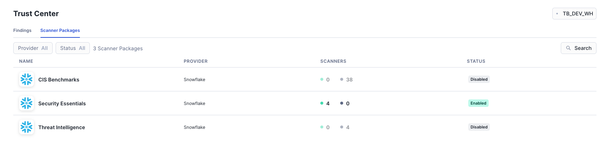

3.  **Enable Package** ボタンをクリックします。

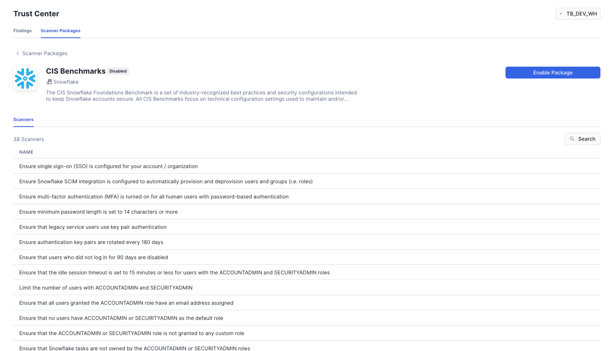

4.  モーダルで **Frequency** を `Monthly` に設定して **Continue** をクリックします。

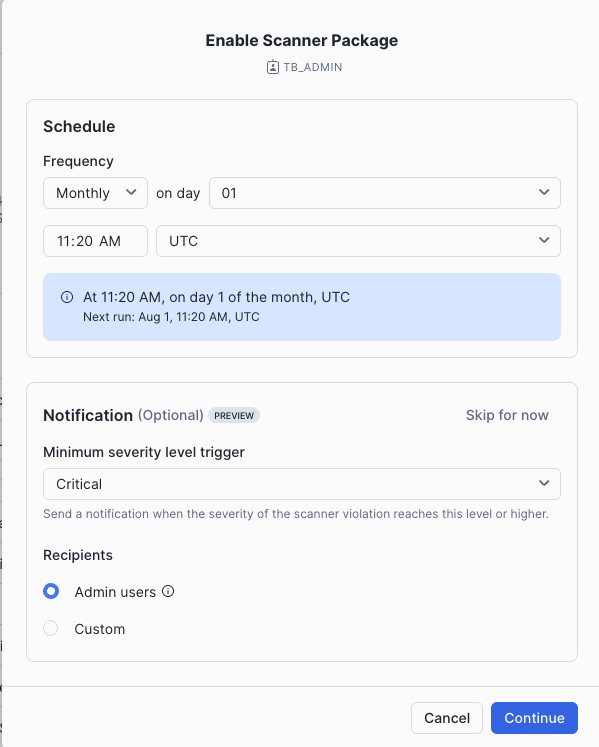

5.  **Threat Intelligence** スキャナーパッケージでも同じ手順を繰り返します。

#### ステップ 3 - 結果の確認

スキャナーが実行されるまで少し待った後、**Findings** タブに戻ります。

  - 重大度別の違反のサマリーダッシュボードが表示されます。
  - 下のリストには各違反、その重大度、検出したスキャナーが詳細に示されます。
  - 任意の違反をクリックすると、サマリーと推奨される修復手順を含む詳細ペインが開きます。
  - リストを重大度、ステータス、またはスキャナーパッケージでフィルタリングして、最も重要な問題に集中できます。

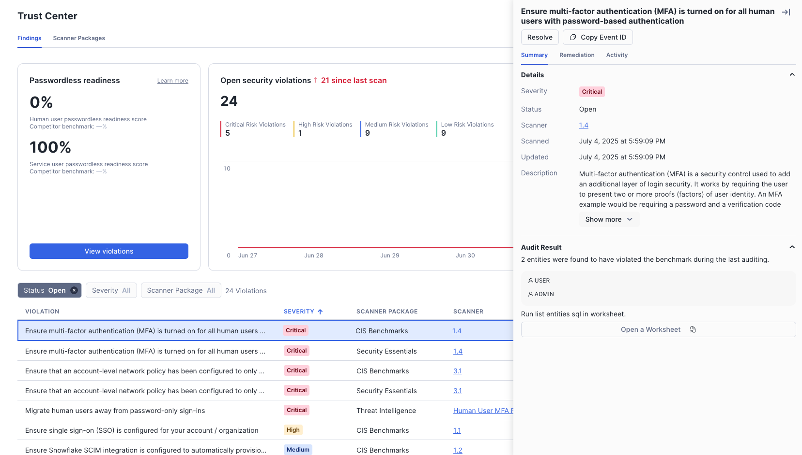

この強力なツールにより、Snowflake アカウントのセキュリティ健全性について継続的で実行可能な概要が得られます。

## アプリとコラボレーション

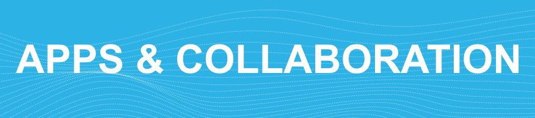

### 概要

このビネットでは、Snowflake マーケットプレイスを通じた Snowflake のシームレスなデータコラボレーションを探ります。ライブですぐにクエリできるサードパーティデータセットを取得し、従来の ETL パイプラインを必要とせずにすぐに内部データと結合して新しいインサイトを解放することがいかに簡単かを見ていきます。

### 学習内容
- Snowflake マーケットプレイスでデータを検索して取得する方法。
- ライブの共有データを即座にクエリする方法。
- マーケットプレイスのデータと自分のアカウントデータを結合して強化されたビューを作成する方法。
- より深い分析のためにサードパーティの POI（Point of Interest）データを活用する方法。
- 複雑なクエリを構造化するために CTE（Common Table Expression）を使用する方法。

### 構築するもの
- 内部売上データと外部の気象データおよび POI データを組み合わせた強化された分析ビュー。

### SQL コードを取得して SQL ファイルに貼り付けます。

**この[ファイル](https://github.com/Snowflake-Labs/sfguide-getting-started-from-zero-to-snowflake/blob/main/scripts/vignette-5.sql)の SQL コードを新しい SQL ファイルにコピーして貼り付け、Snowflake で手順に沿って進めてください。**

### Snowflake マーケットプレイスからのデータ取得


#### 概要

アナリストの一人が天気がフードトラックの売上にどのように影響するかを確認したいと考えています。そのために、Snowflake マーケットプレイスを使って Weather Source からライブの気象データを取得し、自分たちの売上データと直接結合します。マーケットプレイスにより、データの複製や ETL なしに、サードパーティプロバイダーからライブですぐにクエリできるデータにアクセスできます。

> 
> **[Snowflake マーケットプレイスの概要](https://docs.snowflake.com/en/user-guide/data-sharing-intro)**: マーケットプレイスは、さまざまなサードパーティデータ、アプリケーション、AI 製品を発見してアクセスするための集中型ハブを提供します。

#### ステップ 1 - 初期コンテキストの設定

まず、マーケットプレイスからデータを取得するために必要な `accountadmin` ロールを使用するようにコンテキストを設定します。

```sql
USE DATABASE tb_101;
USE ROLE accountadmin;
USE WAREHOUSE tb_de_wh;
```

#### ステップ 2 - Weather Source データの取得

Snowsight UI でこれらの手順に従って Weather Source データを取得します：

1.  `ACCOUNTADMIN` ロールを使用していることを確認します。
2.  左側ナビゲーションメニューから **Data Products** » **Marketplace** に移動します。
3.  検索バーに `Weather Source frostbyte` と入力します。
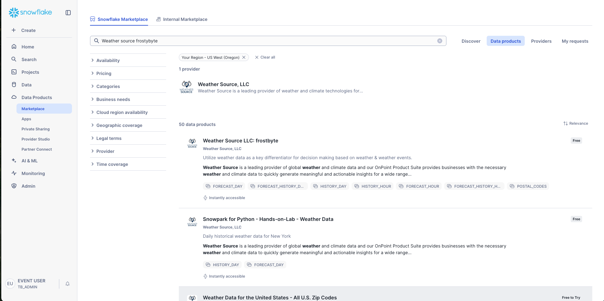

4.  **Weather Source LLC: frostbyte** リスティングをクリックします。
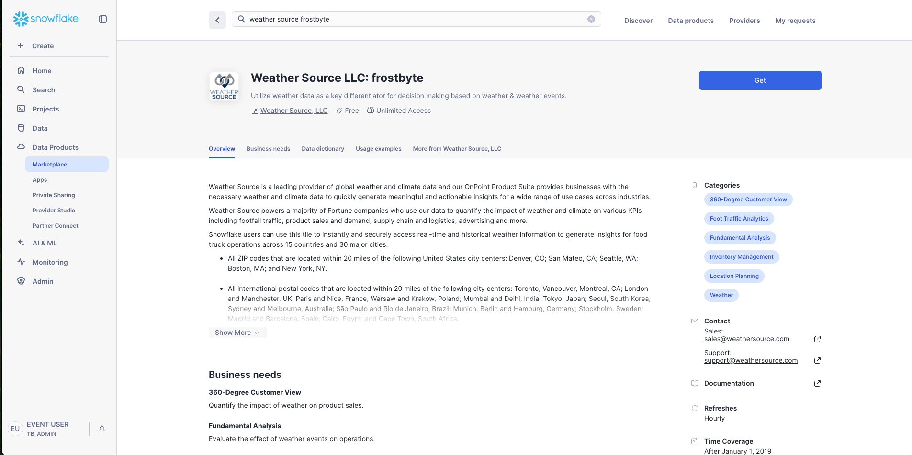

5.  **Get** ボタンをクリックします。
6.  Options を展開し、**Database name** を `ZTS_WEATHERSOURCE` に変更します。
7.  **PUBLIC** ロールへのアクセスを付与します。
8.  **Get** をクリックします。

このプロセスにより、Weather Source データが新しいデータベースとしてアカウントで即座に利用可能になり、クエリの準備ができます。

### アカウントデータと共有データの統合


#### 概要

Weather Source データがアカウントに入ったので、アナリストは既存の Tasty Bytes データとの結合をすぐに開始できます。ETL ジョブの完了を待つ必要はありません。

#### ステップ 1 - 共有データの探索

`tb_analyst` ロールに切り替えて新しい気象データの探索を始めましょう。まず、共有で利用可能なすべての US 都市のリストと、いくつかの平均気象指標を取得します。

```sql
USE ROLE tb_analyst;

SELECT 
    DISTINCT city_name,
    AVG(max_wind_speed_100m_mph) AS avg_wind_speed_mph,
    AVG(avg_temperature_air_2m_f) AS avg_temp_f,
    AVG(tot_precipitation_in) AS avg_precipitation_in,
    MAX(tot_snowfall_in) AS max_snowfall_in
FROM zts_weathersource.onpoint_id.history_day
WHERE country = 'US'
GROUP BY city_name;
```

#### ステップ 2 - 強化されたビューの作成

生の `country` データと Weather Source 共有の過去の日次気象データを結合するビューを作成しましょう。これにより、Tasty Bytes が営業している都市の気象指標の統合ビューが得られます。

```sql
CREATE OR REPLACE VIEW harmonized.daily_weather_v
COMMENT = 'Weather Source Daily History filtered to Tasty Bytes supported Cities'
    AS
SELECT
    hd.*,
    TO_VARCHAR(hd.date_valid_std, 'YYYY-MM') AS yyyy_mm,
    pc.city_name AS city,
    c.country AS country_desc
FROM zts_weathersource.onpoint_id.history_day hd
JOIN zts_weathersource.onpoint_id.postal_codes pc
    ON pc.postal_code = hd.postal_code
    AND pc.country = hd.country
JOIN raw_pos.country c
    ON c.iso_country = hd.country
    AND c.city = hd.city_name;
```

#### ステップ 3 - 強化されたデータの分析と可視化

新しいビューを使って、2022 年 2 月のドイツ・ハンブルクの平均日次気温をクエリします。以下のクエリを実行し、Snowsight で直接折れ線グラフとして可視化します。

```sql
SELECT
    dw.country_desc,
    dw.city_name,
    dw.date_valid_std,
    AVG(dw.avg_temperature_air_2m_f) AS average_temp_f
FROM harmonized.daily_weather_v dw
WHERE dw.country_desc = 'Germany'
    AND dw.city_name = 'Hamburg'
    AND YEAR(date_valid_std) = 2022
    AND MONTH(date_valid_std) = 2
GROUP BY dw.country_desc, dw.city_name, dw.date_valid_std
ORDER BY dw.date_valid_std DESC;
```

1.  上記のクエリを実行します。
2.  **Results** ペインで **Chart** をクリックします。
3.  **Chart Type** を `Line` に設定します。
4.  **X-Axis** を `DATE_VALID_STD` に設定します。
5.  **Y-Axis** を `AVERAGE_TEMP_F` に設定します。

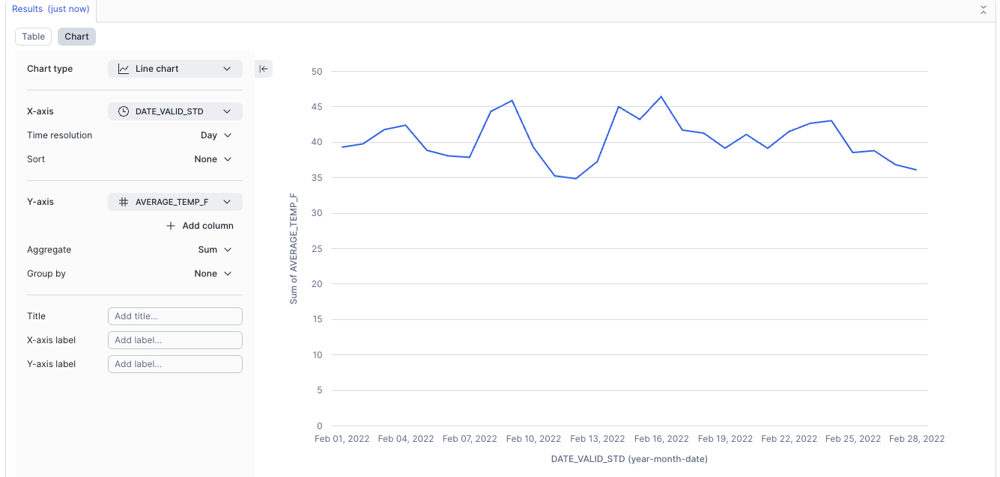

#### ステップ 4 - 売上と気象ビューの作成

さらに一歩進んで、`orders_v` ビューと新しい `daily_weather_v` を組み合わせ、売上が気象条件とどのように相関するかを確認しましょう。

```sql
CREATE OR REPLACE VIEW analytics.daily_sales_by_weather_v
COMMENT = 'Daily Weather Metrics and Orders Data'
AS
WITH daily_orders_aggregated AS (
    SELECT DATE(o.order_ts) AS order_date, o.primary_city, o.country,
        o.menu_item_name, SUM(o.price) AS total_sales
    FROM harmonized.orders_v o
    GROUP BY ALL
)
SELECT
    dw.date_valid_std AS date, dw.city_name, dw.country_desc,
    ZEROIFNULL(doa.total_sales) AS daily_sales, doa.menu_item_name,
    ROUND(dw.avg_temperature_air_2m_f, 2) AS avg_temp_fahrenheit,
    ROUND(dw.tot_precipitation_in, 2) AS avg_precipitation_inches,
    ROUND(dw.tot_snowdepth_in, 2) AS avg_snowdepth_inches,
    dw.max_wind_speed_100m_mph AS max_wind_speed_mph
FROM harmonized.daily_weather_v dw
LEFT JOIN daily_orders_aggregated doa
    ON dw.date_valid_std = doa.order_date
    AND dw.city_name = doa.primary_city
    AND dw.country_desc = doa.country
ORDER BY date ASC;
```

#### ステップ 5 - ビジネスの問いに答える

アナリストは「シアトル市場で大雨が売上数字にどのような影響を与えるか？」などの複雑なビジネスの問いに答えられるようになりました。

```sql
SELECT * EXCLUDE (city_name, country_desc, avg_snowdepth_inches, max_wind_speed_mph)
FROM analytics.daily_sales_by_weather_v
WHERE 
    country_desc = 'United States'
    AND city_name = 'Seattle'
    AND avg_precipitation_inches >= 1.0
ORDER BY date ASC;
```

Snowsight で再び結果を可視化しましょう。今度は棒グラフにします。

1.  上記のクエリを実行します。
2.  **Results** ペインで **Chart** をクリックします。
3.  **Chart Type** を `Bar` に設定します。
4.  **X-Axis** を `MENU_ITEM_NAME` に設定します。
5.  **Y-Axis** を `DAILY_SALES` に設定します。

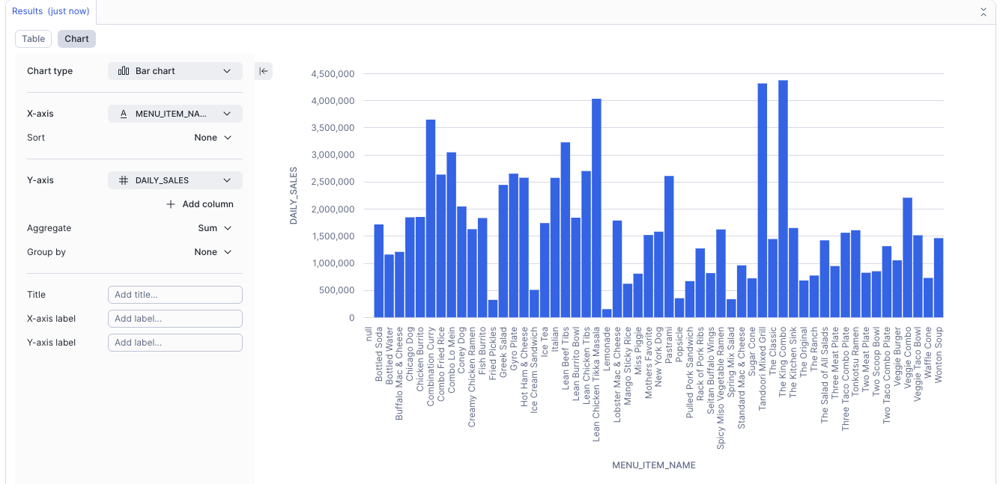

### POI データの探索


#### 概要

アナリストはフードトラックの具体的な場所についてより多くのインサイトを得たいと考えています。Snowflake マーケットプレイスの別プロバイダー Safegraph から POI（Point of Interest）データを取得して、分析をさらに強化できます。

#### ステップ 1 - Safegraph POI データの取得

マーケットプレイスから Safegraph データを取得するには、前と同じ手順に従います。

1.  `ACCOUNTADMIN` ロールを使用していることを確認します。
2.  **Data Products** » **Marketplace** に移動します。
3.  検索バーに `safegraph frostbyte` と入力します。
4.  **Safegraph: frostbyte** リスティングを選択して **Get** をクリックします。
5.  Options を展開し、**Database name** を `ZTS_SAFEGRAPH` に設定します。
6.  **PUBLIC** ロールへのアクセスを付与します。
7.  **Get** をクリックします。

#### ステップ 2 - POI ビューの作成

内部の `location` データと Safegraph POI データを結合するビューを作成しましょう。

```sql
CREATE OR REPLACE VIEW harmonized.tastybytes_poi_v
AS 
SELECT 
    l.location_id, sg.postal_code, sg.country, sg.city, sg.iso_country_code,
    sg.location_name, sg.top_category, sg.category_tags,
    sg.includes_parking_lot, sg.open_hours
FROM raw_pos.location l
JOIN zts_safegraph.public.frostbyte_tb_safegraph_s sg 
    ON l.location_id = sg.location_id
    AND l.iso_country_code = sg.iso_country_code;
```

#### ステップ 3 - POI データと気象データの組み合わせ

これで 3 つのデータセット（内部データ、気象データ、POI データ）をすべて組み合わせることができます。2022 年の US で最も風の強いトラックの場所トップ 3 を見つけましょう。

```sql
SELECT TOP 3
    p.location_id, p.city, p.postal_code,
    AVG(hd.max_wind_speed_100m_mph) AS average_wind_speed
FROM harmonized.tastybytes_poi_v AS p
JOIN zts_weathersource.onpoint_id.history_day AS hd
    ON p.postal_code = hd.postal_code
WHERE
    p.country = 'United States'
    AND YEAR(hd.date_valid_std) = 2022
GROUP BY p.location_id, p.city, p.postal_code
ORDER BY average_wind_speed DESC;
```

#### ステップ 4 - 気象への耐性によるブランド分析

最後に、ブランドの耐性を判断するためのより複雑な分析を行います。CTE を使って最も風の強い場所を先に見つけ、それらの場所での「穏やかな日」と「風の強い日」の各トラックブランドの売上を比較します。これは、耐性の低いブランドに「風の強い日」プロモーションを提供するなどの運用上の意思決定に役立てることができます。

```sql
WITH TopWindiestLocations AS (
    SELECT TOP 3
        p.location_id
    FROM harmonized.tastybytes_poi_v AS p
    JOIN zts_weathersource.onpoint_id.history_day AS hd ON p.postal_code = hd.postal_code
    WHERE p.country = 'United States' AND YEAR(hd.date_valid_std) = 2022
    GROUP BY p.location_id, p.city, p.postal_code
    ORDER BY AVG(hd.max_wind_speed_100m_mph) DESC
)
SELECT
    o.truck_brand_name,
    ROUND(AVG(CASE WHEN hd.max_wind_speed_100m_mph <= 20 THEN o.order_total END), 2) AS avg_sales_calm_days,
    ZEROIFNULL(ROUND(AVG(CASE WHEN hd.max_wind_speed_100m_mph > 20 THEN o.order_total END), 2)) AS avg_sales_windy_days
FROM analytics.orders_v AS o
JOIN zts_weathersource.onpoint_id.history_day AS hd
    ON o.primary_city = hd.city_name AND DATE(o.order_ts) = hd.date_valid_std
WHERE o.location_id IN (SELECT location_id FROM TopWindiestLocations)
GROUP BY o.truck_brand_name
ORDER BY o.truck_brand_name;
```

### Streamlit in Snowflake の紹介


Streamlit は、機械学習とデータサイエンスのウェブアプリケーションを簡単に作成・共有するために設計されたオープンソースの Python ライブラリです。データ駆動型アプリの迅速な開発と展開を可能にします。

Streamlit in Snowflake は、開発者が Snowflake 内で直接アプリケーションを安全に構築、展開、共有できるようにします。この統合により、データや Application コードを外部システムに移動させることなく、Snowflake に保存されたデータを処理・利用するアプリを構築できます。
***
#### ステップ 1 - Streamlit アプリの作成
**2022 年 2 月の日本での各メニュー項目の売上データを表示・グラフ化する最初の Streamlit アプリを作成しましょう。**

1. まず、**Projects** » **Streamlit** に移動し、右上の青い「+ Streamlit App」ボタンをクリックして新しいアプリを作成します。

2. 「Create Streamlit App」ポップアップにこれらの値を入力します：
    - App title: Menu Item Sales
    - App location:
        - Database: tb_101
        - Schema: Analytics
    - App warehouse: tb_dev_wh
3. 「Create」をクリックします。
アプリが最初に読み込まれると、右ペインにサンプルアプリが表示され、左側のエディタペインにアプリのコードが表示されます。

4. すべてのコードを選択して削除します。
5. **次に、この[コード](https://github.com/Snowflake-Labs/sfguide-getting-started-from-zero-to-snowflake/blob/main/streamlit/streamlit_app.py)を空のエディタウィンドウにコピー＆ペーストし、右上の「Run」をクリックします。**


## まとめとリソース

#### 概要

おめでとうございます！Tasty Bytes - Zero to Snowflake の旅を無事完了しました。

ウェアハウスの構築と設定、データのクローンと変換、タイムトラベルによるドロップされたテーブルの復元、半構造化データの自動化データパイプラインの構築をすべて達成しました。また、シンプルな AISQL 関数で分析を生成し、Snowflake Copilot でワークフローを加速することで AI を使ってインサイトを解き放ちました。さらに、ロールとポリシーを使った堅牢なガバナンスフレームワークを実装し、Snowflake マーケットプレイスからのライブデータセットで自分のデータをシームレスに強化しました。

このクイックスタートを再実行したい場合は、SQL ファイルの最下部にある完全な `RESET` スクリプトを実行してください。

#### 学習内容のまとめ
- **ウェアハウスとパフォーマンス：** 仮想ウェアハウスの作成、管理、スケーリング方法、および Snowflake の結果キャッシュの活用方法。
- **データ変換：** 安全な開発のためのゼロコピークローニング、データの変換、タイムトラベルと `UNDROP` を使ったエラーからの即座の復元方法。
- **データパイプライン：** 外部ステージからのデータ取り込み、半構造化 `VARIANT` データの処理、ダイナミックテーブルを使った自動化 ELT パイプラインの構築方法。
- **Snowflake Cortex AI：** 顧客分析プラットフォームの構築のために Snowflake Cortex AI を活用する方法。
- **データガバナンス：** ロールベースのアクセス制御、自動化 PII 分類、タグベースのデータマスキング、行アクセスポリシーを使ったセキュリティフレームワークの実装方法。
- **データコラボレーション：** Snowflake マーケットプレイスからライブのサードパーティデータセットを発見・取得し、自分のデータとシームレスに結合して新しいインサイトを生成する方法。

#### リソース
- [仮想ウェアハウスと設定](https://docs.snowflake.com/en/user-guide/warehouses-overview)
- [リソースモニター](https://docs.snowflake.com/en/user-guide/resource-monitors)
- [バジェット](https://docs.snowflake.com/en/user-guide/budgets)
- [ユニバーサルサーチ](https://docs.snowflake.com/en/user-guide/ui-snowsight-universal-search)
- [外部ステージからの取り込み](https://docs.snowflake.com/en/sql-reference/sql/copy-into-table)
- [半構造化データ](https://docs.snowflake.com/en/sql-reference/data-types-semistructured)
- [ダイナミックテーブル](https://docs.snowflake.com/en/user-guide/dynamic-tables-about)
- [ロールとアクセス制御](https://docs.snowflake.com/en/user-guide/security-access-control-overview)
- [タグベースの分類](https://docs.snowflake.com/en/user-guide/classify-auto)
- [マスキングポリシーによるカラムレベルセキュリティ](https://docs.snowflake.com/en/user-guide/security-column-intro)
- [行アクセスポリシーによる行レベルセキュリティ](https://docs.snowflake.com/en/user-guide/security-row-intro)
- [データメトリック関数](https://docs.snowflake.com/en/user-guide/data-quality-intro)
- [トラストセンター](https://docs.snowflake.com/en/user-guide/trust-center/overview)
- [データ共有](https://docs.snowflake.com/en/user-guide/data-sharing-intro)
- [Snowflake Cortex Playground](https://docs.snowflake.com/en/user-guide/snowflake-cortex/cortex-playground)
- [Snowflake Cortex の AI SQL 関数](https://docs.snowflake.com/en/user-guide/snowflake-cortex/aisql)
- [Snowflake Cortex Search の概要](https://docs.snowflake.com/en/user-guide/snowflake-cortex/cortex-search/cortex-search-overview)
- [Snowflake Cortex Analyst](https://docs.snowflake.com/en/user-guide/snowflake-cortex/cortex-analyst)
